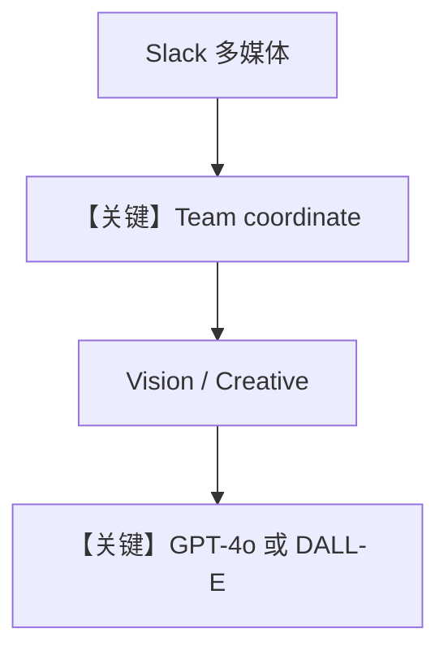

# multimodal_team.py — 实现原理分析

> 源文件：`cookbook/05_agent_os/interfaces/slack/multimodal_team.py`

## 概述

本示例展示 Agno 的 **Slack + Team + 多模态（视觉/DALL-E/文件）** 机制：`Team` 以 `mode="coordinate"` 与明确 `instructions` 在 **Vision Analyst** 与 **Creative Agent** 间路由；Slack 侧 `streaming=True`，`suggested_prompts` 引导用户发图或生成图。

**核心配置一览：**

| 配置项 | 值 | 说明 |
|--------|------|------|
| `multimodal_team` | `Team(mode="coordinate", model=gpt-4o, members=[...])` | 协调模式 |
| `vision_analyst` | 无 tools，视觉/文件分析 |  |
| `creative_agent` | `DalleTools()` + `WebSearchTools()` | 生图+搜索 |
| `Slack` | `team=multimodal_team`，`suggested_prompts` |  |

## 架构分层

```
Slack（图片/文件消息）→ Team → 成员 Agent → GPT-4o / DALL-E API
```

## 核心组件解析

### 多模态输入

Slack 传图/文件进入 run，`OpenAIChat` 与消息组装支持 image/file parts（见 `get_run_messages` 与媒体处理）。

### 运行机制与因果链

Team `instructions` 规定「先描述再生成」的协作顺序。

### 还原后的 Team instructions 字面量

```text
Route image analysis and file analysis tasks to Vision Analyst.
Route image generation and web search tasks to Creative Agent.
If the user sends an image and asks to recreate/modify it, first ask Vision Analyst to describe it, then ask Creative Agent to generate a new version.
```

## 完整 API 请求

- 视觉：`chat.completions` 带 image content。
- DALL-E：经 `DalleTools` 调图像生成 API（以工具实现为准）。

## Mermaid 流程图



## 关键源码文件索引

| 文件 | 关键函数/类 | 作用 |
|------|------------|------|
| `agno/team/_messages.py` | `get_system_message()` | Team system |
| `agno/tools/dalle.py` | `DalleTools` | 生图 |
