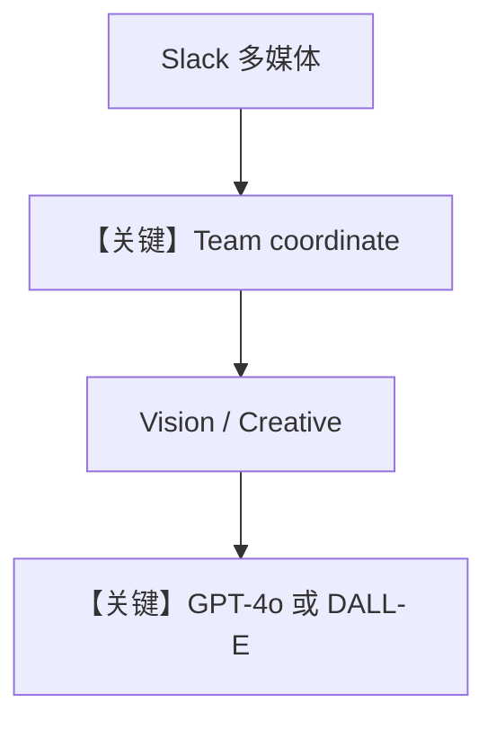

# multimodal_team.py — 实现原理分析

<!-- cookbook-py-source:start -->
## 完整源码

```python
"""
Multimodal Team
===============

Tests streaming a multi-agent team with multimodal input/output in Slack.

Capabilities tested:
  - Image INPUT:  Send an image to the bot, team analyzes it (GPT-4o vision)
  - Image OUTPUT: Ask to generate an image, DALL-E creates it, uploaded to Slack
  - File INPUT:   Send a CSV/text file, team analyzes it
  - Combined:     Send image + ask to modify/recreate it

Team members:
  - Vision Analyst: Understands images and files via GPT-4o
  - Creative Agent: Generates images via DALL-E + web search

Slack scopes: app_mentions:read, assistant:write, chat:write, im:history,
             files:read, files:write
"""

from agno.agent import Agent
from agno.models.openai import OpenAIChat
from agno.os.app import AgentOS
from agno.os.interfaces.slack import Slack
from agno.team import Team
from agno.tools.dalle import DalleTools
from agno.tools.websearch import WebSearchTools

# ---------------------------------------------------------------------------
# Team Members
# ---------------------------------------------------------------------------

vision_analyst = Agent(
    name="Vision Analyst",
    model=OpenAIChat(id="gpt-4o"),
    role="Analyzes images, files, and visual content in detail.",
    instructions=[
        "You are an expert visual analyst.",
        "When given an image, describe it thoroughly: subjects, colors, composition, text, mood.",
        "When given files (CSV, code, text), analyze their content and provide insights.",
        "Always format with markdown: bold, italics, bullet points.",
    ],
    markdown=True,
)

creative_agent = Agent(
    name="Creative Agent",
    model=OpenAIChat(id="gpt-4o"),
    role="Generates images with DALL-E and searches the web.",
    tools=[DalleTools(), WebSearchTools()],
    instructions=[
        "You are a creative assistant with image generation abilities.",
        "Use DALL-E to generate images when asked.",
        "Use web search when you need reference information.",
        "Describe generated images briefly after creation.",
    ],
    markdown=True,
)

# ---------------------------------------------------------------------------
# Team
# ---------------------------------------------------------------------------

multimodal_team = Team(
    name="Multimodal Team",
    mode="coordinate",
    model=OpenAIChat(id="gpt-4o"),
    members=[vision_analyst, creative_agent],
    instructions=[
        "Route image analysis and file analysis tasks to Vision Analyst.",
        "Route image generation and web search tasks to Creative Agent.",
        "If the user sends an image and asks to recreate/modify it, first ask Vision Analyst to describe it, then ask Creative Agent to generate a new version.",
    ],
    show_members_responses=False,
    markdown=True,
)

# ---------------------------------------------------------------------------
# AgentOS
# ---------------------------------------------------------------------------

agent_os = AgentOS(
    teams=[multimodal_team],
    interfaces=[
        Slack(
            team=multimodal_team,
            streaming=True,
            reply_to_mentions_only=True,
            suggested_prompts=[
                {
                    "title": "Analyze",
                    "message": "Send me an image and I'll analyze it in detail",
                },
                {
                    "title": "Generate",
                    "message": "Generate an image of a sunset over mountains",
                },
                {"title": "Search", "message": "Search for the latest AI art trends"},
            ],
        )
    ],
)
app = agent_os.get_app()


if __name__ == "__main__":
    agent_os.serve(app="multimodal_team:app", reload=True)
```

<!-- cookbook-py-source:end -->

> 源文件：`cookbook/05_agent_os/interfaces/slack/multimodal_team.py`

## 概述

本示例展示 Agno 的 **Slack + Team + 多模态（视觉/DALL-E/文件）** 机制：`Team` 以 `mode="coordinate"` 与明确 `instructions` 在 **Vision Analyst** 与 **Creative Agent** 间路由；Slack 侧 `streaming=True`，`suggested_prompts` 引导用户发图或生成图。

**核心配置一览：**

| 配置项 | 值 | 说明 |
|--------|------|------|
| `multimodal_team` | `Team(mode="coordinate", model=gpt-4o, members=[...])` | 协调模式 |
| `vision_analyst` | 无 tools，视觉/文件分析 |  |
| `creative_agent` | `DalleTools()` + `WebSearchTools()` | 生图+搜索 |
| `Slack` | `team=multimodal_team`，`suggested_prompts` |  |

## 架构分层

```
Slack（图片/文件消息）→ Team → 成员 Agent → GPT-4o / DALL-E API
```

## 核心组件解析

### 多模态输入

Slack 传图/文件进入 run，`OpenAIChat` 与消息组装支持 image/file parts（见 `get_run_messages` 与媒体处理）。

### 运行机制与因果链

Team `instructions` 规定「先描述再生成」的协作顺序。

### 还原后的 Team instructions 字面量

```text
Route image analysis and file analysis tasks to Vision Analyst.
Route image generation and web search tasks to Creative Agent.
If the user sends an image and asks to recreate/modify it, first ask Vision Analyst to describe it, then ask Creative Agent to generate a new version.
```

## 完整 API 请求

- 视觉：`chat.completions` 带 image content。
- DALL-E：经 `DalleTools` 调图像生成 API（以工具实现为准）。

## Mermaid 流程图



## 关键源码文件索引

| 文件 | 关键函数/类 | 作用 |
|------|------------|------|
| `agno/team/_messages.py` | `get_system_message()` | Team system |
| `agno/tools/dalle.py` | `DalleTools` | 生图 |
