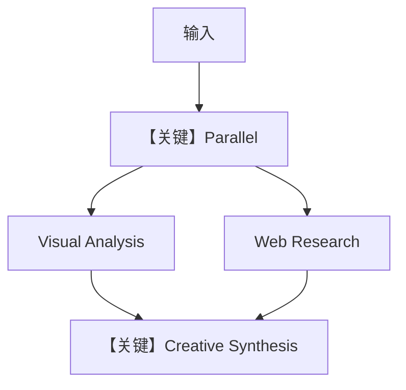

# multimodal_workflow.py — 实现原理分析

> 源文件：`cookbook/05_agent_os/interfaces/slack/multimodal_workflow.py`

## 概述

本示例展示 Agno 的 **Workflow 并行阶段（Parallel）+ 顺序综合** 机制：`Parallel(analysis_step, research_step)` 同时跑视觉分析与网页调研，再经 `synthesis_step` 用 `DalleTools` 综合并可选生图；`Slack(workflow=creative_workflow)` 暴露流式与建议提示。

**核心配置一览：**

| 配置项 | 值 | 说明 |
|--------|------|------|
| `research_phase` | `Parallel(analysis_step, research_step)` | 并行 |
| `creative_workflow` | `Workflow(steps=[research_phase, synthesis_step])` | 先并后串 |
| `analyst` / `researcher` / `synthesizer` | 均为 `gpt-4o` |  |
| `Slack` | `workflow=creative_workflow`, `streaming=True` |  |

## 架构分层

```
Slack → Workflow → Parallel 两路 → Step 合并 → Slack
```

## 核心组件解析

### `Parallel`

`agno.workflow.Parallel` 包装两步并发执行，再进入后续 `Step`（见 `workflow` 模块）。

### 运行机制与因果链

与顺序 `basic_workflow` 对比：本文件突出 **并行研究阶段** 与 **多模态**。

## System Prompt 组装

三步各自 `Agent` 独立 `get_system_message`；无单一全局 Agent。

## 完整 API 请求

并行阶段各自 `invoke`；综合步可能带工具与多模态消息。

## Mermaid 流程图



## 关键源码文件索引

| 文件 | 关键函数/类 | 作用 |
|------|------------|------|
| `agno/workflow` | `Parallel`, `Workflow` | 并行编排 |
