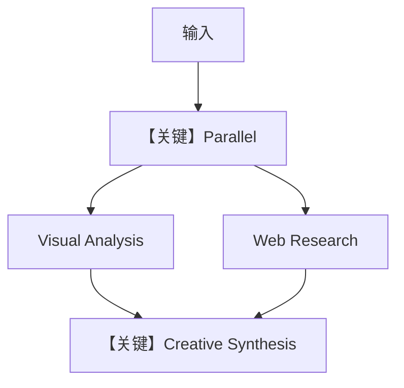

# multimodal_workflow.py — 实现原理分析

<!-- cookbook-py-source:start -->
## 完整源码

```python
"""
Multimodal Workflow
===================

Tests streaming a workflow with multimodal input/output in Slack.

Capabilities tested:
  - Image INPUT:  Send an image, workflow processes it through steps
  - Image OUTPUT: DALL-E generates images during workflow steps
  - Parallel execution: Two steps run simultaneously
  - Sequential synthesis: Final step combines parallel results

Workflow structure:
  Parallel:
    - Visual Analysis (analyzes any input images/files)
    - Web Research (searches for related context)
  Sequential:
    - Creative Synthesis (generates a new image inspired by analysis + research)

Slack scopes: app_mentions:read, assistant:write, chat:write, im:history,
             files:read, files:write
"""

from agno.agent import Agent
from agno.models.openai import OpenAIChat
from agno.os.app import AgentOS
from agno.os.interfaces.slack import Slack
from agno.tools.dalle import DalleTools
from agno.tools.websearch import WebSearchTools
from agno.workflow import Parallel, Step, Workflow

# ---------------------------------------------------------------------------
# Step Agents
# ---------------------------------------------------------------------------

analyst = Agent(
    name="Visual Analyst",
    model=OpenAIChat(id="gpt-4o"),
    instructions=[
        "Analyze any images or files provided.",
        "Describe visual elements, composition, colors, mood.",
        "If no image, analyze the text topic visually.",
        "Keep analysis concise but detailed.",
    ],
    markdown=True,
)

researcher = Agent(
    name="Web Researcher",
    model=OpenAIChat(id="gpt-4o"),
    tools=[WebSearchTools()],
    instructions=[
        "Search the web for information related to the user's request.",
        "Provide relevant facts, trends, and context.",
        "Format results with markdown.",
    ],
    markdown=True,
)

synthesizer = Agent(
    name="Creative Synthesizer",
    model=OpenAIChat(id="gpt-4o"),
    tools=[DalleTools()],
    instructions=[
        "Combine the analysis and research from previous steps.",
        "If the user asked for an image, generate one with DALL-E.",
        "Provide a final comprehensive response.",
        "Format with markdown.",
    ],
    markdown=True,
)

# ---------------------------------------------------------------------------
# Workflow
# ---------------------------------------------------------------------------

analysis_step = Step(
    name="Visual Analysis",
    agent=analyst,
    description="Analyze input images/files or describe the topic visually",
)

research_step = Step(
    name="Web Research",
    agent=researcher,
    description="Search the web for related context and information",
)

research_phase = Parallel(
    analysis_step,
    research_step,
    name="Research Phase",
)

synthesis_step = Step(
    name="Creative Synthesis",
    agent=synthesizer,
    description="Combine analysis + research into a final response, generate images if requested",
)

creative_workflow = Workflow(
    name="Creative Pipeline",
    steps=[research_phase, synthesis_step],
)

# ---------------------------------------------------------------------------
# AgentOS
# ---------------------------------------------------------------------------

agent_os = AgentOS(
    workflows=[creative_workflow],
    interfaces=[
        Slack(
            workflow=creative_workflow,
            streaming=True,
            reply_to_mentions_only=True,
            suggested_prompts=[
                {
                    "title": "Analyze",
                    "message": "Send me an image to analyze and research",
                },
                {
                    "title": "Create",
                    "message": "Research cyberpunk art trends and generate an image",
                },
                {
                    "title": "Compare",
                    "message": "Compare impressionism and expressionism art styles",
                },
            ],
        )
    ],
)
app = agent_os.get_app()


if __name__ == "__main__":
    agent_os.serve(app="multimodal_workflow:app", reload=True)
```

<!-- cookbook-py-source:end -->

> 源文件：`cookbook/05_agent_os/interfaces/slack/multimodal_workflow.py`

## 概述

本示例展示 Agno 的 **Workflow 并行阶段（Parallel）+ 顺序综合** 机制：`Parallel(analysis_step, research_step)` 同时跑视觉分析与网页调研，再经 `synthesis_step` 用 `DalleTools` 综合并可选生图；`Slack(workflow=creative_workflow)` 暴露流式与建议提示。

**核心配置一览：**

| 配置项 | 值 | 说明 |
|--------|------|------|
| `research_phase` | `Parallel(analysis_step, research_step)` | 并行 |
| `creative_workflow` | `Workflow(steps=[research_phase, synthesis_step])` | 先并后串 |
| `analyst` / `researcher` / `synthesizer` | 均为 `gpt-4o` |  |
| `Slack` | `workflow=creative_workflow`, `streaming=True` |  |

## 架构分层

```
Slack → Workflow → Parallel 两路 → Step 合并 → Slack
```

## 核心组件解析

### `Parallel`

`agno.workflow.Parallel` 包装两步并发执行，再进入后续 `Step`（见 `workflow` 模块）。

### 运行机制与因果链

与顺序 `basic_workflow` 对比：本文件突出 **并行研究阶段** 与 **多模态**。

## System Prompt 组装

三步各自 `Agent` 独立 `get_system_message`；无单一全局 Agent。

## 完整 API 请求

并行阶段各自 `invoke`；综合步可能带工具与多模态消息。

## Mermaid 流程图



## 关键源码文件索引

| 文件 | 关键函数/类 | 作用 |
|------|------------|------|
| `agno/workflow` | `Parallel`, `Workflow` | 并行编排 |
