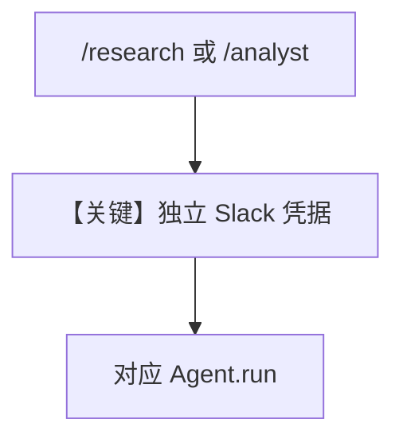

# multiple_instances.md — 实现原理分析

> 源文件：`cookbook/05_agent_os/interfaces/slack/multiple_instances.py`

## 概述

本示例展示 Agno 的 **多 Slack 应用 + 环境变量凭据 + 路径前缀** 机制：在同一 `AgentOS` 注册 `research_agent`（`WebSearchTools`）与 `analyst_agent`（纯分析指令），分别挂载 `/research` 与 `/analyst` 事件 URL，与 `multi_bot.py` 同属多 bot 部署范式但 **未强制 streaming**。

**核心配置一览：**

| 配置项 | 值 | 说明 |
|--------|------|------|
| `research_agent` | `gpt-5-mini` + `WebSearchTools` | 调研 |
| `analyst_agent` | `gpt-5-mini`，分析师 instructions |  |
| `db` | 共享 `SqliteDb` | 会话表 |
| `Slack`×2 | `prefix` + `RESEARCH_*` / `ANALYST_*` env |  |

## 架构分层

与 `multi_bot.md` 相同：**多接口 → 多 Agent → 模型**。

## 核心组件解析

### 与 `interfaces/agui/multiple_instances.md` 差异

Slack 用 **token/signing_secret**；AGUI 用 **HTTP 前缀 + 浏览器**。

## System Prompt 组装

### analyst_agent 字面量

```text
You are a data analyst. Help users interpret data and create insights.
```

`research_agent` 无显式 `instructions`，依赖默认与工具说明。

## 完整 API 请求

`OpenAIChat` → `chat.completions.create`。

## Mermaid 流程图



## 关键源码文件索引

| 文件 | 关键函数/类 | 作用 |
|------|------------|------|
| `agno/os/interfaces/slack` | `Slack(prefix)` | 多实例 |
