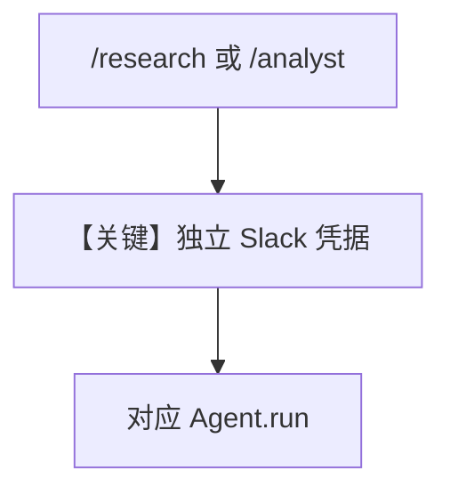

# multiple_instances.md — 实现原理分析

<!-- cookbook-py-source:start -->
## 完整源码

```python
"""
Multiple Slack Bot Instances
============================

Deploy multiple agents as separate Slack bots in one workspace.
Each bot has its own identity, token, and signing secret.

Setup:
  1. Create two Slack apps at https://api.slack.com/apps
  2. Install both apps to the same workspace
  3. Set each app's Event Subscription URL to its prefix:
       - @ResearchBot  ->  https://myapp.com/research/events
       - @AnalystBot   ->  https://myapp.com/analyst/events
  4. Set environment variables (or pass tokens directly):
       RESEARCH_SLACK_TOKEN, RESEARCH_SLACK_SIGNING_SECRET
       ANALYST_SLACK_TOKEN,  ANALYST_SLACK_SIGNING_SECRET

Slack scopes (per app): app_mentions:read, assistant:write, chat:write, im:history
"""

from os import getenv

from agno.agent import Agent
from agno.db.sqlite.sqlite import SqliteDb
from agno.models.openai import OpenAIChat
from agno.os.app import AgentOS
from agno.os.interfaces.slack import Slack
from agno.tools.websearch import WebSearchTools

# ---------------------------------------------------------------------------
# Agents
# ---------------------------------------------------------------------------

agent_db = SqliteDb(session_table="agent_sessions", db_file="tmp/persistent_memory.db")

research_agent = Agent(
    name="Research Agent",
    model=OpenAIChat(id="gpt-5-mini"),
    tools=[WebSearchTools()],
    db=agent_db,
    add_history_to_context=True,
    num_history_runs=3,
    add_datetime_to_context=True,
)

analyst_agent = Agent(
    name="Analyst Agent",
    model=OpenAIChat(id="gpt-5-mini"),
    instructions=[
        "You are a data analyst. Help users interpret data and create insights."
    ],
    db=agent_db,
    add_history_to_context=True,
    num_history_runs=3,
    add_datetime_to_context=True,
)

# ---------------------------------------------------------------------------
# AgentOS — each Slack interface gets its own credentials
# ---------------------------------------------------------------------------

agent_os = AgentOS(
    agents=[research_agent, analyst_agent],
    interfaces=[
        Slack(
            agent=research_agent,
            prefix="/research",
            token=getenv("RESEARCH_SLACK_TOKEN"),
            signing_secret=getenv("RESEARCH_SLACK_SIGNING_SECRET"),
        ),
        Slack(
            agent=analyst_agent,
            prefix="/analyst",
            token=getenv("ANALYST_SLACK_TOKEN"),
            signing_secret=getenv("ANALYST_SLACK_SIGNING_SECRET"),
        ),
    ],
)
app = agent_os.get_app()


# ---------------------------------------------------------------------------
# Run
# ---------------------------------------------------------------------------

if __name__ == "__main__":
    agent_os.serve(app="multiple_instances:app", reload=True)
```

<!-- cookbook-py-source:end -->

> 源文件：`cookbook/05_agent_os/interfaces/slack/multiple_instances.py`

## 概述

本示例展示 Agno 的 **多 Slack 应用 + 环境变量凭据 + 路径前缀** 机制：在同一 `AgentOS` 注册 `research_agent`（`WebSearchTools`）与 `analyst_agent`（纯分析指令），分别挂载 `/research` 与 `/analyst` 事件 URL，与 `multi_bot.py` 同属多 bot 部署范式但 **未强制 streaming**。

**核心配置一览：**

| 配置项 | 值 | 说明 |
|--------|------|------|
| `research_agent` | `gpt-5-mini` + `WebSearchTools` | 调研 |
| `analyst_agent` | `gpt-5-mini`，分析师 instructions |  |
| `db` | 共享 `SqliteDb` | 会话表 |
| `Slack`×2 | `prefix` + `RESEARCH_*` / `ANALYST_*` env |  |

## 架构分层

与 `multi_bot.md` 相同：**多接口 → 多 Agent → 模型**。

## 核心组件解析

### 与 `interfaces/agui/multiple_instances.md` 差异

Slack 用 **token/signing_secret**；AGUI 用 **HTTP 前缀 + 浏览器**。

## System Prompt 组装

### analyst_agent 字面量

```text
You are a data analyst. Help users interpret data and create insights.
```

`research_agent` 无显式 `instructions`，依赖默认与工具说明。

## 完整 API 请求

`OpenAIChat` → `chat.completions.create`。

## Mermaid 流程图



## 关键源码文件索引

| 文件 | 关键函数/类 | 作用 |
|------|------------|------|
| `agno/os/interfaces/slack` | `Slack(prefix)` | 多实例 |
