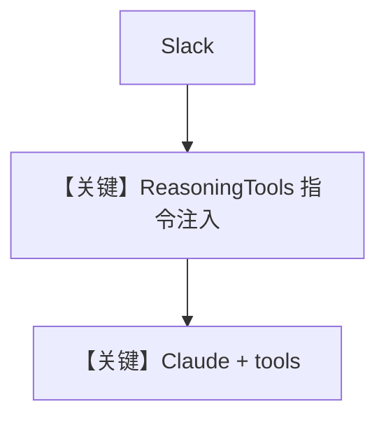

# reasoning_agent.md — 实现原理分析

<!-- cookbook-py-source:start -->
## 完整源码

```python
"""
Reasoning Agent
===============

An agent with ReasoningTools that thinks step-by-step before answering.
Combines structured reasoning with web search for finance questions.

Key concepts:
  - ``ReasoningTools(add_instructions=True)`` injects chain-of-thought
    prompting into the agent's system message.
  - The agent uses tables for data display and keeps thinking concise.

Slack scopes: app_mentions:read, assistant:write, chat:write, im:history
"""

from agno.agent import Agent
from agno.db.sqlite import SqliteDb
from agno.models.anthropic import Claude
from agno.os.app import AgentOS
from agno.os.interfaces.slack import Slack
from agno.tools.reasoning import ReasoningTools
from agno.tools.websearch import WebSearchTools

# ---------------------------------------------------------------------------
# Create Example
# ---------------------------------------------------------------------------

agent_db = SqliteDb(session_table="agent_sessions", db_file="tmp/persistent_memory.db")

reasoning_finance_agent = Agent(
    name="Reasoning Finance Agent",
    model=Claude(id="claude-sonnet-4-20250514"),
    db=agent_db,
    tools=[
        ReasoningTools(add_instructions=True),
        WebSearchTools(),
    ],
    instructions="Use tables to display data. When you use thinking tools, keep the thinking brief.",
    add_datetime_to_context=True,
    markdown=True,
)

# Setup our AgentOS app
agent_os = AgentOS(
    agents=[reasoning_finance_agent],
    interfaces=[Slack(agent=reasoning_finance_agent)],
)
app = agent_os.get_app()


# ---------------------------------------------------------------------------
# Run Example
# ---------------------------------------------------------------------------

if __name__ == "__main__":
    """Run your AgentOS.

    You can see the configuration and available apps at:
    http://localhost:7777/config

    """
    agent_os.serve(app="reasoning_agent:app", reload=True)
```

<!-- cookbook-py-source:end -->

> 源文件：`cookbook/05_agent_os/interfaces/slack/reasoning_agent.py`

## 概述

本示例展示 Agno 的 **`ReasoningTools(add_instructions=True)` + Claude + 联网** 机制：`ReasoningTools` 向 system 注入分步思考类说明，与 `WebSearchTools` 组合用于金融等需推理与检索的场景；Slack 为默认单接口。

**核心配置一览：**

| 配置项 | 值 | 说明 |
|--------|------|------|
| `model` | `Claude(id="claude-sonnet-4-20250514")` | Anthropic |
| `tools` | `[ReasoningTools(add_instructions=True), WebSearchTools()]` | 推理+搜索 |
| `instructions` | 单行（表格展示、思考简短） |  |
| `db` | `SqliteDb` | 会话 |

## 架构分层

```
Slack → Agent → ReasoningTools 扩展 system → Claude.invoke
```

## 核心组件解析

### `ReasoningTools(add_instructions=True)`

在 `_tool_instructions` 或等价路径向 system 注入「如何使用思考工具」的段落（与 `agno/tools/reasoning` 实现一致）。

### 运行机制与因果链

模型可先调用 reasoning 工具再搜索，再表格输出。

## System Prompt 组装

### 还原后的 instructions 字面量

```text
Use tables to display data. When you use thinking tools, keep the thinking brief.
```

另含 ReasoningTools 注入段与工具 schema 说明。

## 完整 API 请求

Anthropic **Messages API**（`Claude.invoke`），`tools` 含 reasoning 与 search 定义。

## Mermaid 流程图



## 关键源码文件索引

| 文件 | 关键函数/类 | 作用 |
|------|------------|------|
| `agno/tools/reasoning` | `ReasoningTools` | 思考工具 |
| `agno/models/anthropic/claude.py` | `invoke()` | API |
