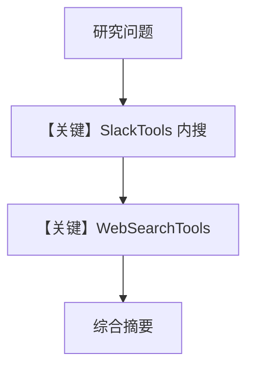

# research_assistant.md — 实现原理分析

<!-- cookbook-py-source:start -->
## 完整源码

```python
"""
Research Assistant
==================

An agent that combines Slack message search with web search to answer
research questions. Searches internal Slack history first, then gathers
external context from the web.

Key concepts:
  - ``SlackTools`` search supports Slack query syntax
    (``from:@user``, ``in:#channel``, ``has:link``, ``before:/after:``).
  - ``WebSearchTools`` provides external web search.
  - The agent synthesizes internal and external findings into one summary.

Slack scopes: app_mentions:read, assistant:write, chat:write, im:history,
             search:read, channels:history, users:read
"""

from agno.agent import Agent
from agno.db.sqlite import SqliteDb
from agno.models.openai import OpenAIChat
from agno.os.app import AgentOS
from agno.os.interfaces.slack import Slack
from agno.tools.slack import SlackTools
from agno.tools.websearch import WebSearchTools

# ---------------------------------------------------------------------------
# Create Example
# ---------------------------------------------------------------------------

agent_db = SqliteDb(session_table="agent_sessions", db_file="tmp/research_assistant.db")

research_assistant = Agent(
    name="Research Assistant",
    model=OpenAIChat(id="gpt-4o"),
    db=agent_db,
    tools=[
        SlackTools(
            enable_search_messages=True,
            enable_get_thread=True,
            enable_list_users=True,
            enable_get_user_info=True,
        ),
        WebSearchTools(),
    ],
    instructions=[
        "You are a research assistant that helps find information.",
        "You can search Slack messages using: from:@user, in:#channel, has:link, before:/after:date",
        "You can also search the web for current information.",
        "When asked to research something:",
        "1. Search Slack for internal discussions",
        "2. Search the web for external context",
        "3. Synthesize findings into a clear summary",
        "Identify relevant experts by looking at who contributed to discussions.",
    ],
    add_history_to_context=True,
    num_history_runs=3,
    add_datetime_to_context=True,
    markdown=True,
)

agent_os = AgentOS(
    agents=[research_assistant],
    interfaces=[
        Slack(
            agent=research_assistant,
            reply_to_mentions_only=True,
        )
    ],
)
app = agent_os.get_app()

# ---------------------------------------------------------------------------
# Run Example
# ---------------------------------------------------------------------------

if __name__ == "__main__":
    agent_os.serve(app="research_assistant:app", reload=True)
```

<!-- cookbook-py-source:end -->

> 源文件：`cookbook/05_agent_os/interfaces/slack/research_assistant.py`

## 概述

本示例展示 Agno 的 **Slack 内搜 + 外网搜** 机制：`SlackTools` 提供频道/用户/线程语境下的消息搜索，`WebSearchTools` 拉外部信息；instructions 要求「先 Slack 后 Web 再综合」。

**核心配置一览：**

| 配置项 | 值 | 说明 |
|--------|------|------|
| `tools` | `SlackTools(...)` + `WebSearchTools()` | 双源 |
| `model` | `OpenAIChat(id="gpt-4o")` | Chat Completions |
| `instructions` | 多行列表 | 检索策略 |

## 架构分层

```
Slack → Agent → 交替 tool_calls（Slack API / Web）→ 汇总回复
```

## System Prompt 组装

### 还原后的完整 instructions（字面量合并）

要点：先搜 Slack（`from:@user` 等语法），再搜网页，再综合；识别讨论贡献者。

## 完整 API 请求

`chat.completions.create` with many tools from two toolkits.

## Mermaid 流程图



## 关键源码文件索引

| 文件 | 关键函数/类 | 作用 |
|------|------------|------|
| `agno/tools/slack` | `SlackTools` | 内搜 |
| `agno/tools/websearch` | `WebSearchTools` | 外搜 |
