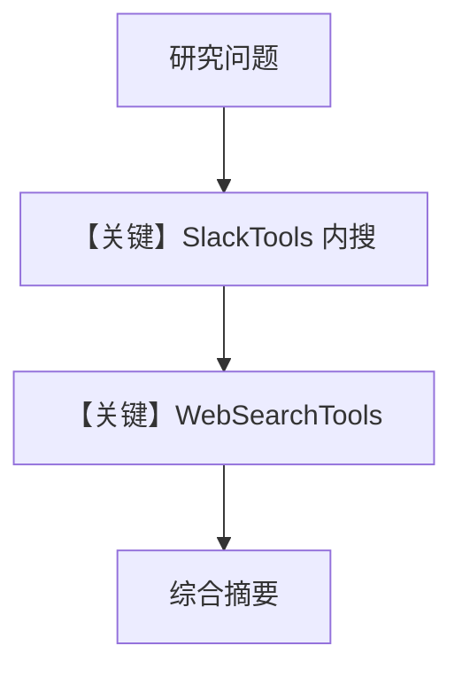

# research_assistant.md — 实现原理分析

> 源文件：`cookbook/05_agent_os/interfaces/slack/research_assistant.py`

## 概述

本示例展示 Agno 的 **Slack 内搜 + 外网搜** 机制：`SlackTools` 提供频道/用户/线程语境下的消息搜索，`WebSearchTools` 拉外部信息；instructions 要求「先 Slack 后 Web 再综合」。

**核心配置一览：**

| 配置项 | 值 | 说明 |
|--------|------|------|
| `tools` | `SlackTools(...)` + `WebSearchTools()` | 双源 |
| `model` | `OpenAIChat(id="gpt-4o")` | Chat Completions |
| `instructions` | 多行列表 | 检索策略 |

## 架构分层

```
Slack → Agent → 交替 tool_calls（Slack API / Web）→ 汇总回复
```

## System Prompt 组装

### 还原后的完整 instructions（字面量合并）

要点：先搜 Slack（`from:@user` 等语法），再搜网页，再综合；识别讨论贡献者。

## 完整 API 请求

`chat.completions.create` with many tools from two toolkits.

## Mermaid 流程图



## 关键源码文件索引

| 文件 | 关键函数/类 | 作用 |
|------|------------|------|
| `agno/tools/slack` | `SlackTools` | 内搜 |
| `agno/tools/websearch` | `WebSearchTools` | 外搜 |
