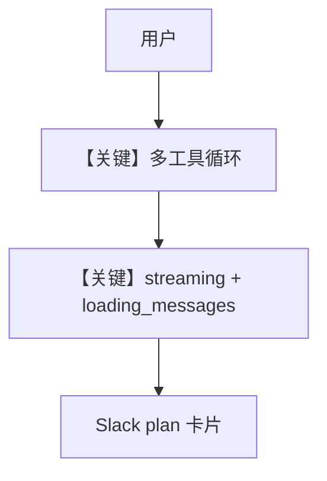

# streaming_deep_research.md — 实现原理分析

<!-- cookbook-py-source:start -->
## 完整源码

```python
"""
Streaming Deep Research Agent
==============================

A multi-tool research agent that exercises many different tool types
to stress-test the Slack streaming plan block UI.

Uses 7 toolkits across web search, finance, news, academic papers,
and calculations — a single query can trigger 8-12+ tool calls,
each rendering as a card in the plan block.

Slack scopes: app_mentions:read, assistant:write, chat:write, im:history
"""

from agno.agent import Agent
from agno.db.sqlite.sqlite import SqliteDb
from agno.models.openai import OpenAIChat
from agno.os.app import AgentOS
from agno.os.interfaces.slack import Slack
from agno.tools.arxiv import ArxivTools
from agno.tools.calculator import CalculatorTools
from agno.tools.duckduckgo import DuckDuckGoTools
from agno.tools.hackernews import HackerNewsTools
from agno.tools.newspaper4k import Newspaper4kTools
from agno.tools.wikipedia import WikipediaTools
from agno.tools.yfinance import YFinanceTools

agent_db = SqliteDb(
    session_table="deep_research_sessions", db_file="tmp/deep_research.db"
)

deep_research_agent = Agent(
    name="Deep Research Agent",
    model=OpenAIChat(id="gpt-4.1"),
    tools=[
        DuckDuckGoTools(),
        HackerNewsTools(),
        YFinanceTools(
            enable_stock_price=True,
            enable_company_info=True,
            enable_analyst_recommendations=True,
            enable_company_news=True,
        ),
        WikipediaTools(),
        ArxivTools(),
        CalculatorTools(),
        Newspaper4kTools(),
    ],
    instructions=[
        "You are a deep research assistant that gathers information from MANY sources.",
        "For every query, use AT LEAST 4 different tools to provide comprehensive answers.",
        "Always search the web AND check HackerNews AND Wikipedia for context.",
        "For finance questions, pull stock data, analyst recommendations, AND company news.",
        "For technical topics, also search Arxiv for relevant research papers.",
        "Use the calculator for any numerical analysis or comparisons.",
        "Use newspaper4k to read full articles when you find interesting URLs.",
        "Synthesize all findings into a well-structured summary with sections.",
    ],
    db=agent_db,
    add_history_to_context=True,
    num_history_runs=3,
    add_datetime_to_context=True,
    markdown=True,
)

agent_os = AgentOS(
    agents=[deep_research_agent],
    interfaces=[
        Slack(
            agent=deep_research_agent,
            streaming=True,
            reply_to_mentions_only=True,
            loading_messages=[
                "Researching across multiple sources...",
                "Gathering data from 7 different tools...",
                "Cross-referencing findings...",
                "Analyzing and synthesizing results...",
            ],
            suggested_prompts=[
                {
                    "title": "Deep Stock Analysis",
                    "message": "Do a deep analysis of NVDA: get the stock price, company info, analyst recommendations, latest news, search the web for recent developments, check HackerNews discussions, and look up Nvidia on Wikipedia for company background",
                },
                {
                    "title": "AI Research Deep Dive",
                    "message": "Research the latest developments in large language models: search the web, check HackerNews, look up recent Arxiv papers on LLMs, and read the Wikipedia article on large language models for background context",
                },
                {
                    "title": "Tech Company Comparison",
                    "message": "Compare AAPL and MSFT: get both stock prices, analyst recommendations, company info, search for recent news about both, and calculate the price-to-earnings ratio difference",
                },
                {
                    "title": "Trending Tech News",
                    "message": "What are the biggest tech stories today? Check HackerNews top stories, search the web for breaking tech news, and read the full text of the top 2 articles you find",
                },
            ],
        )
    ],
)
app = agent_os.get_app()


if __name__ == "__main__":
    agent_os.serve(app="streaming_deep_research:app", reload=True)
```

<!-- cookbook-py-source:end -->

> 源文件：`cookbook/05_agent_os/interfaces/slack/streaming_deep_research.py`

## 概述

本示例展示 Agno 的 **多工具组合压测 + Slack 流式 + loading_messages + suggested_prompts** 机制：单 Agent 挂载 7 类工具（DuckDuckGo、HackerNews、yfinance、Wikipedia、Arxiv、Calculator、Newspaper4k），instructions 要求每答至少用 4 种工具，以触发 Slack 侧 **plan block** 多卡片 UI。

**核心配置一览：**

| 配置项 | 值 | 说明 |
|--------|------|------|
| `model` | `OpenAIChat(id="gpt-4.1")` | Chat Completions |
| `tools` | 7 个 Toolkit 实例 | 多源 |
| `Slack` | `streaming=True`，`loading_messages=[...]`，`suggested_prompts` | UX |
| `instructions` | 多行 | 强制多工具 |

## 架构分层

```
用户长查询 → Agent 多轮 tool_calls → 流式增量 → Slack 卡片
```

## 核心组件解析

### `loading_messages`

在长时间工具执行时轮换状态文案（接口层行为）。

### 运行机制与因果链

单 query 可 8～12+ 次 tool_calls，用于 **压力测试** 前端渲染。

## System Prompt 组装

instructions 强调「至少 4 工具」、财经/技术场景的分支策略；完整字面量见源文件 L49-57。

## 完整 API 请求

多次 `chat.completions` 往返（工具循环）或单次长会话内多 tool 轮次。

## Mermaid 流程图



## 关键源码文件索引

| 文件 | 关键函数/类 | 作用 |
|------|------------|------|
| `agno/os/interfaces/slack` | `Slack(streaming, loading_messages)` | UX |
| `agno/agent` | tool 循环 | agentic loop |
