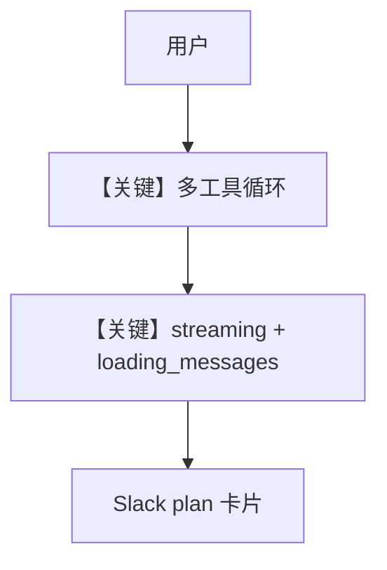

# streaming_deep_research.md — 实现原理分析

> 源文件：`cookbook/05_agent_os/interfaces/slack/streaming_deep_research.py`

## 概述

本示例展示 Agno 的 **多工具组合压测 + Slack 流式 + loading_messages + suggested_prompts** 机制：单 Agent 挂载 7 类工具（DuckDuckGo、HackerNews、yfinance、Wikipedia、Arxiv、Calculator、Newspaper4k），instructions 要求每答至少用 4 种工具，以触发 Slack 侧 **plan block** 多卡片 UI。

**核心配置一览：**

| 配置项 | 值 | 说明 |
|--------|------|------|
| `model` | `OpenAIChat(id="gpt-4.1")` | Chat Completions |
| `tools` | 7 个 Toolkit 实例 | 多源 |
| `Slack` | `streaming=True`，`loading_messages=[...]`，`suggested_prompts` | UX |
| `instructions` | 多行 | 强制多工具 |

## 架构分层

```
用户长查询 → Agent 多轮 tool_calls → 流式增量 → Slack 卡片
```

## 核心组件解析

### `loading_messages`

在长时间工具执行时轮换状态文案（接口层行为）。

### 运行机制与因果链

单 query 可 8～12+ 次 tool_calls，用于 **压力测试** 前端渲染。

## System Prompt 组装

instructions 强调「至少 4 工具」、财经/技术场景的分支策略；完整字面量见源文件 L49-57。

## 完整 API 请求

多次 `chat.completions` 往返（工具循环）或单次长会话内多 tool 轮次。

## Mermaid 流程图



## 关键源码文件索引

| 文件 | 关键函数/类 | 作用 |
|------|------------|------|
| `agno/os/interfaces/slack` | `Slack(streaming, loading_messages)` | UX |
| `agno/agent` | tool 循环 | agentic loop |
