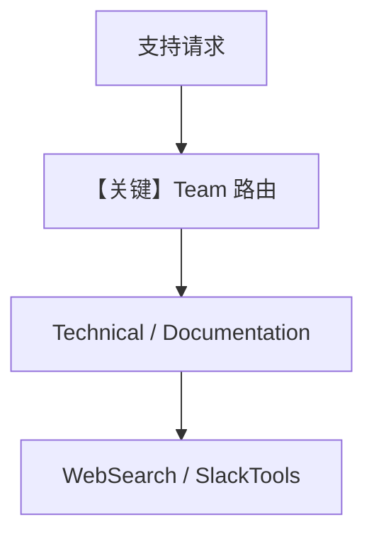

# support_team.md — 实现原理分析

<!-- cookbook-py-source:start -->
## 完整源码

```python
"""
Support Team
============

A multi-agent team that routes support questions to the right specialist.
Technical Support handles code and API questions; Documentation Specialist
searches Slack history and the web for existing answers.

Key concepts:
  - ``Team`` with a coordinator model routes questions to the best member.
  - One member uses ``SlackTools`` to find past answers in Slack threads.
  - Both members use ``WebSearchTools`` for external documentation.

Slack scopes: app_mentions:read, assistant:write, chat:write, im:history,
             search:read, channels:history
"""

from agno.agent import Agent
from agno.db.sqlite import SqliteDb
from agno.models.openai import OpenAIChat
from agno.os.app import AgentOS
from agno.os.interfaces.slack import Slack
from agno.team import Team
from agno.tools.slack import SlackTools
from agno.tools.websearch import WebSearchTools

# ---------------------------------------------------------------------------
# Create Example
# ---------------------------------------------------------------------------

team_db = SqliteDb(session_table="team_sessions", db_file="tmp/support_team.db")

# Technical Support Agent
tech_support = Agent(
    name="Technical Support",
    role="Code and technical troubleshooting",
    model=OpenAIChat(id="gpt-4o"),
    tools=[WebSearchTools()],
    instructions=[
        "You handle technical questions about code, APIs, and implementation.",
        "Provide code examples when helpful.",
        "Search for current documentation and best practices.",
    ],
    markdown=True,
)

# Documentation Agent
docs_agent = Agent(
    name="Documentation Specialist",
    role="Finding and explaining documentation",
    model=OpenAIChat(id="gpt-4o"),
    tools=[
        SlackTools(
            enable_search_messages=True,
            enable_get_thread=True,
        ),
        WebSearchTools(),
    ],
    instructions=[
        "You find relevant documentation and past discussions.",
        "Search Slack for previous answers to similar questions.",
        "Search the web for official documentation.",
        "Explain documentation in simple terms.",
    ],
    markdown=True,
)

# The Team with a coordinator
support_team = Team(
    name="Support Team",
    model=OpenAIChat(id="gpt-4o"),
    members=[tech_support, docs_agent],
    description="A support team that routes questions to the right specialist.",
    instructions=[
        "You coordinate support requests.",
        "Route technical/code questions to Technical Support.",
        "Route 'how do I' or 'where is' questions to Documentation Specialist.",
        "For complex questions, consult both agents.",
    ],
    db=team_db,
    add_history_to_context=True,
    num_history_runs=3,
    markdown=True,
)

agent_os = AgentOS(
    teams=[support_team],
    interfaces=[
        Slack(
            team=support_team,
            reply_to_mentions_only=True,
        )
    ],
)
app = agent_os.get_app()

# ---------------------------------------------------------------------------
# Run Example
# ---------------------------------------------------------------------------

if __name__ == "__main__":
    agent_os.serve(app="support_team:app", reload=True)
```

<!-- cookbook-py-source:end -->

> 源文件：`cookbook/05_agent_os/interfaces/slack/support_team.py`

## 概述

本示例展示 Agno 的 **Slack + Team 客服路由** 机制：`Team` 协调 **Technical Support**（纯 `WebSearchTools`）与 **Documentation Specialist**（`SlackTools` 搜历史 + 联网）；共享 `team_db` 与 `add_history_to_context`。

**核心配置一览：**

| 配置项 | 值 | 说明 |
|--------|------|------|
| `support_team` | `Team(model=gpt-4o, members=[tech_support, docs_agent])` | 队长协调 |
| `tech_support` | 技术排错 + 联网 |  |
| `docs_agent` | Slack 搜旧答 + 官方文档检索 |  |
| `Slack` | `team=support_team` |  |

## 架构分层

```
Slack → Team.run → 依问题路由成员 → 各 OpenAIChat.invoke
```

## System Prompt 组装

### Team description / instructions 字面量

```text
A support team that routes questions to the right specialist.
```

```text
You coordinate support requests.
Route technical/code questions to Technical Support.
Route 'how do I' or 'where is' questions to Documentation Specialist.
For complex questions, consult both agents.
```

成员 instructions 见源文件 L39-64。

## 完整 API 请求

队长与成员均为 Chat Completions（`gpt-4o`）。

## Mermaid 流程图



## 关键源码文件索引

| 文件 | 关键函数/类 | 作用 |
|------|------------|------|
| `agno/team/_messages.py` | `get_system_message()` | Team system |
| `agno/tools/slack` | `SlackTools` | 搜历史 |
