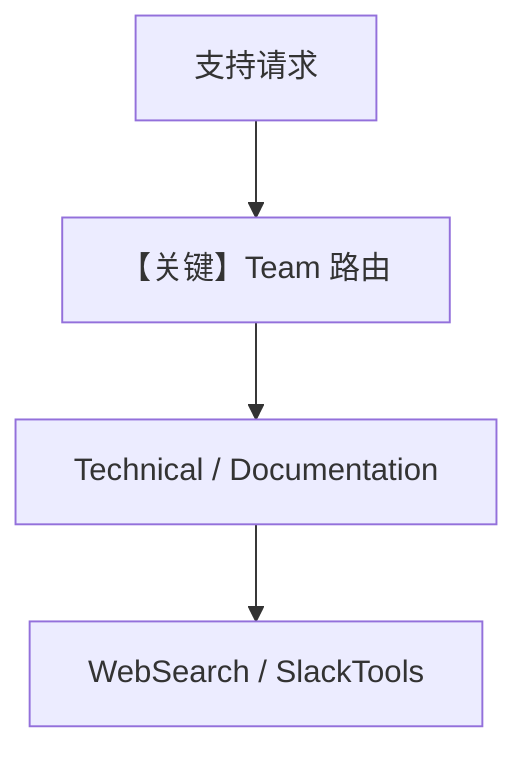

# support_team.md — 实现原理分析

> 源文件：`cookbook/05_agent_os/interfaces/slack/support_team.py`

## 概述

本示例展示 Agno 的 **Slack + Team 客服路由** 机制：`Team` 协调 **Technical Support**（纯 `WebSearchTools`）与 **Documentation Specialist**（`SlackTools` 搜历史 + 联网）；共享 `team_db` 与 `add_history_to_context`。

**核心配置一览：**

| 配置项 | 值 | 说明 |
|--------|------|------|
| `support_team` | `Team(model=gpt-4o, members=[tech_support, docs_agent])` | 队长协调 |
| `tech_support` | 技术排错 + 联网 |  |
| `docs_agent` | Slack 搜旧答 + 官方文档检索 |  |
| `Slack` | `team=support_team` |  |

## 架构分层

```
Slack → Team.run → 依问题路由成员 → 各 OpenAIChat.invoke
```

## System Prompt 组装

### Team description / instructions 字面量

```text
A support team that routes questions to the right specialist.
```

```text
You coordinate support requests.
Route technical/code questions to Technical Support.
Route 'how do I' or 'where is' questions to Documentation Specialist.
For complex questions, consult both agents.
```

成员 instructions 见源文件 L39-64。

## 完整 API 请求

队长与成员均为 Chat Completions（`gpt-4o`）。

## Mermaid 流程图



## 关键源码文件索引

| 文件 | 关键函数/类 | 作用 |
|------|------------|------|
| `agno/team/_messages.py` | `get_system_message()` | Team system |
| `agno/tools/slack` | `SlackTools` | 搜历史 |
