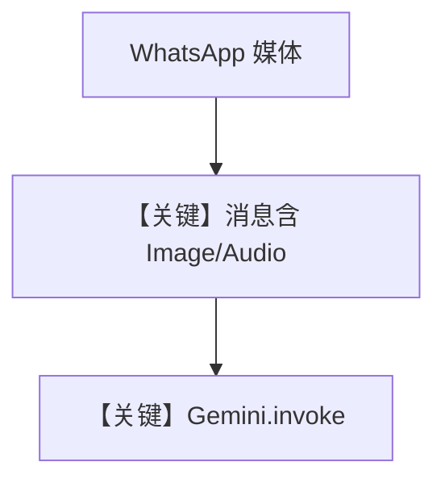

# agent_with_media.py — 实现原理分析

> 源文件：`cookbook/05_agent_os/interfaces/whatsapp/agent_with_media.py`

## 概述

本示例展示 Agno 的 **WhatsApp + Gemini 多模态** 机制：`Gemini(id="gemini-3-flash-preview")` 处理用户经 WhatsApp 发送的图片/音频等附件；`SqliteDb` 与历史使会话可延续。

**核心配置一览：**

| 配置项 | 值 | 说明 |
|--------|------|------|
| `model` | `Gemini(id="gemini-3-flash-preview")` | Google Generative API |
| `db` | `SqliteDb` | 会话 |
| `add_history_to_context` | `True`，`num_history_runs=3` | 是 |
| `add_datetime_to_context` | `True` | 是 |
| `markdown` | `True` | 是 |
| `Whatsapp` | 默认单实例 |  |

## 架构分层

```
WhatsApp 媒体消息 → Whatsapp 适配器 → Agent.run → Gemini.invoke（多模态 parts）
```

## 核心组件解析

### 无显式 `instructions`

默认 system 由模型附加段、时间、markdown 等构成；媒体内容进入 user/run 消息。

### 运行机制与因果链

媒体从 WhatsApp webhook 进入 `RunInput`，由框架组装为 Gemini 的 `contents`（见 `gemini.py`）。

## System Prompt 组装

无静态长 `instructions`；还原文本以动态段为主，可运行时打印 `get_system_message` 结果验证。

## 完整 API 请求

`Gemini.invoke`（`libs/agno/agno/models/google/gemini.py` 约 L507+），使用 Google AI 兼容的 generate/generate_content 形态（以源码为准），非 OpenAI。

## Mermaid 流程图



## 关键源码文件索引

| 文件 | 关键函数/类 | 作用 |
|------|------------|------|
| `agno/models/google/gemini.py` | `invoke()` | Google API |
| `agno/os/interfaces/whatsapp` | `Whatsapp` | 通道 |
