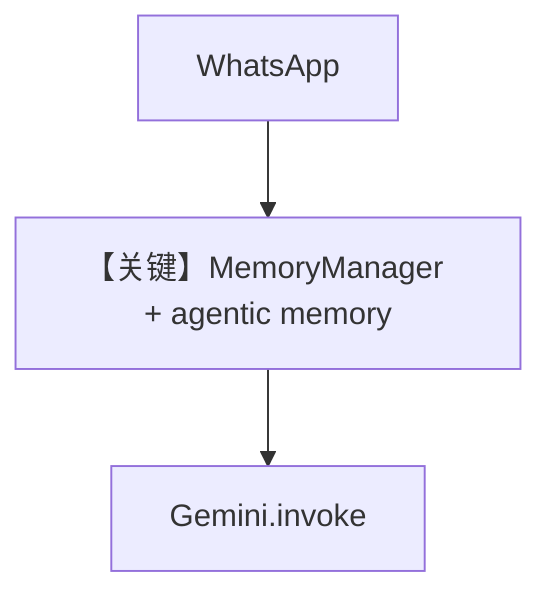

# agent_with_user_memory.py — 实现原理分析

<!-- cookbook-py-source:start -->
## 完整源码

```python
"""
Agent With User Memory
======================

Demonstrates agent with user memory.
"""

from textwrap import dedent

from agno.agent import Agent
from agno.db.sqlite import SqliteDb
from agno.memory.manager import MemoryManager
from agno.models.google import Gemini
from agno.os.app import AgentOS
from agno.os.interfaces.whatsapp import Whatsapp
from agno.tools.websearch import WebSearchTools

# ---------------------------------------------------------------------------
# Create Example
# ---------------------------------------------------------------------------

agent_db = SqliteDb(db_file="tmp/persistent_memory.db")

memory_manager = MemoryManager(
    memory_capture_instructions="""\
                    Collect User's name,
                    Collect Information about user's passion and hobbies,
                    Collect Information about the users likes and dislikes,
                    Collect information about what the user is doing with their life right now
                """,
    model=Gemini(id="gemini-2.0-flash"),
)


personal_agent = Agent(
    name="Basic Agent",
    model=Gemini(id="gemini-2.0-flash"),
    tools=[WebSearchTools()],
    add_history_to_context=True,
    num_history_runs=3,
    add_datetime_to_context=True,
    markdown=True,
    db=agent_db,
    memory_manager=memory_manager,
    enable_agentic_memory=True,
    instructions=dedent("""
        You are a personal AI friend of the user, your purpose is to chat with the user about things and make them feel good.
        First introduce yourself and ask for their name then, ask about themeselves, their hobbies, what they like to do and what they like to talk about.
        Use DuckDuckGo search tool to find latest information about things in the conversations
    """),
    debug_mode=True,
)


# Setup our AgentOS app
agent_os = AgentOS(
    agents=[personal_agent],
    interfaces=[Whatsapp(agent=personal_agent)],
)
app = agent_os.get_app()


# ---------------------------------------------------------------------------
# Run Example
# ---------------------------------------------------------------------------

if __name__ == "__main__":
    """Run your AgentOS.

    You can see the configuration and available apps at:
    http://localhost:7777/config

    """
    agent_os.serve(app="agent_with_user_memory:app", reload=True)
```

<!-- cookbook-py-source:end -->

> 源文件：`cookbook/05_agent_os/interfaces/whatsapp/agent_with_user_memory.py`

## 概述

本示例展示 Agno 的 **WhatsApp + Gemini + MemoryManager + enable_agentic_memory** 机制：与 Slack 记忆示例类似，但通道为 `Whatsapp`；记忆抽取子模型为 `Gemini(id="gemini-2.0-flash")`，主对话同型号；`WebSearchTools` 对应 instructions 中的 DuckDuckGo 表述（以实际工具类为准）。

**核心配置一览：**

| 配置项 | 值 | 说明 |
|--------|------|------|
| `model` | `Gemini(id="gemini-2.0-flash")` | 主对话 |
| `memory_manager.model` | `Gemini(id="gemini-2.0-flash")` | 记忆抽取 |
| `enable_agentic_memory` | `True` | 代理式记忆工具 |
| `tools` | `[WebSearchTools()]` | 联网 |
| `instructions` | `dedent(...)` | 个人朋友人设 |
| `update_memory_on_run` | 未显式设置 | 与 `enable_agentic_memory` 组合行为见 `agno/memory` |

## 架构分层

```
WhatsApp → Agent → Gemini + 记忆管线
```

## System Prompt 组装

### 还原后的 instructions 字面量

```text
You are a personal AI friend of the user, your purpose is to chat with the user about things and make them feel good.
First introduce yourself and ask for their name then, ask about themeselves, their hobbies, what they like to do and what they like to talk about.
Use DuckDuckGo search tool to find latest information about things in the conversations
```

（拼写 `themeselves` 与源码一致。）

另含 `# 3.3.9` memories、`enable_agentic_memory` 的 `<updating_user_memories>` 等段。

## 完整 API 请求

主对话：`Gemini.invoke`；记忆子调用：另一路 Gemini 请求（由 MemoryManager 发起）。

## Mermaid 流程图



## 关键源码文件索引

| 文件 | 关键函数/类 | 作用 |
|------|------------|------|
| `agno/memory/manager.py` | `MemoryManager` | 记忆 |
| `agno/models/google/gemini.py` | `invoke()` | API |
