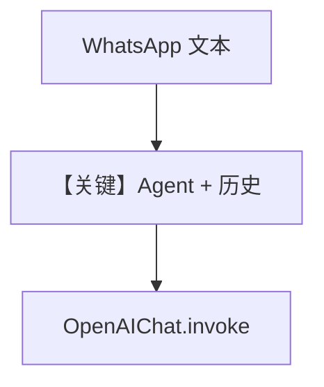

# basic.py — 实现原理分析

<!-- cookbook-py-source:start -->
## 完整源码

```python
"""
Basic
=====

Demonstrates basic.
"""

from agno.agent import Agent
from agno.db.sqlite import SqliteDb
from agno.models.openai import OpenAIChat
from agno.os.app import AgentOS
from agno.os.interfaces.whatsapp import Whatsapp

# ---------------------------------------------------------------------------
# Create Example
# ---------------------------------------------------------------------------

agent_db = SqliteDb(db_file="tmp/persistent_memory.db")
basic_agent = Agent(
    name="Basic Agent",
    model=OpenAIChat(id="gpt-4o"),
    db=agent_db,
    add_history_to_context=True,
    num_history_runs=3,
    add_datetime_to_context=True,
    markdown=True,
)


# Setup our AgentOS app
agent_os = AgentOS(
    agents=[basic_agent],
    interfaces=[Whatsapp(agent=basic_agent)],
)
app = agent_os.get_app()


# ---------------------------------------------------------------------------
# Run Example
# ---------------------------------------------------------------------------

if __name__ == "__main__":
    """Run your AgentOS.

    You can see the configuration and available apps at:
    http://localhost:7777/config

    """
    agent_os.serve(app="basic:app", reload=True)
```

<!-- cookbook-py-source:end -->

> 源文件：`cookbook/05_agent_os/interfaces/whatsapp/basic.py`

## 概述

本示例展示 Agno 的 **WhatsApp + OpenAI Chat 最小助手** 机制：`OpenAIChat(gpt-4o)`、`SqliteDb` 持久会话、`add_history_to_context` 与 `markdown`，无工具。

**核心配置一览：**

| 配置项 | 值 | 说明 |
|--------|------|------|
| `model` | `OpenAIChat(id="gpt-4o")` | Chat Completions |
| `db` | `SqliteDb` | 会话 |
| `add_history_to_context` | `True`，`num_history_runs=3` | 是 |
| `add_datetime_to_context` | `True` | 是 |
| `markdown` | `True` | 是 |

## 架构分层

```
WhatsApp → Whatsapp 适配器 → Agent → OpenAIChat.invoke
```

## System Prompt 组装

无 `instructions`/`description`；含时间、markdown 提示等默认段。

## 完整 API 请求

`client.chat.completions.create(model="gpt-4o", messages=[...])`

## Mermaid 流程图



## 关键源码文件索引

| 文件 | 关键函数/类 | 作用 |
|------|------------|------|
| `agno/models/openai/chat.py` | `invoke()` | Chat Completions |
| `agno/os/interfaces/whatsapp` | `Whatsapp` | 通道 |
