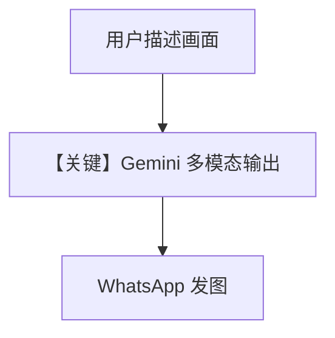

# image_generation_model.py — 实现原理分析

> 源文件：`cookbook/05_agent_os/interfaces/whatsapp/image_generation_model.py`

## 概述

本示例展示 Agno 的 **Gemini 原生图文多模态响应 + WhatsApp** 机制：`Gemini` 配置 `response_modalities=["Text", "Image"]` 与 `id="models/gemini-2.5-flash-image"`，由**模型侧**直接输出图像，而非单独 DALL·E 工具。

**核心配置一览：**

| 配置项 | 值 | 说明 |
|--------|------|------|
| `id`（Agent） | `"image_generation_model"` | 稳定 ID |
| `model` | `Gemini(id="models/gemini-2.5-flash-image", response_modalities=[...])` | 文本+图像 |
| `instructions` | `None` | 未设置 |
| `db` | `SqliteDb` | 会话 |
| `debug_mode` | `True` | 调试 |

## 架构分层

```
用户提示 → Gemini 多模态生成 → 响应含 image parts → Whatsapp 发回媒体
```

## 核心组件解析

### `response_modalities`

告知 Gemini 客户端同时请求文本与图像块（具体参数名以 `gemini.py` 中 `get_request_params` 为准）。

### 运行机制与因果链

与 `image_generation_tools.py`（OpenAI 工具生图）路径不同：本文件为 **模型内建生图**。

## System Prompt 组装

无显式 instructions；system 主要为模型默认与 `# 3.3.14` 等段。

## 完整 API 请求

Google GenAI `generate_content` 系列调用，带 modalities；非 `chat.completions`。

## Mermaid 流程图



## 关键源码文件索引

| 文件 | 关键函数/类 | 作用 |
|------|------------|------|
| `agno/models/google/gemini.py` | `Gemini`，`invoke()` | modalities |
