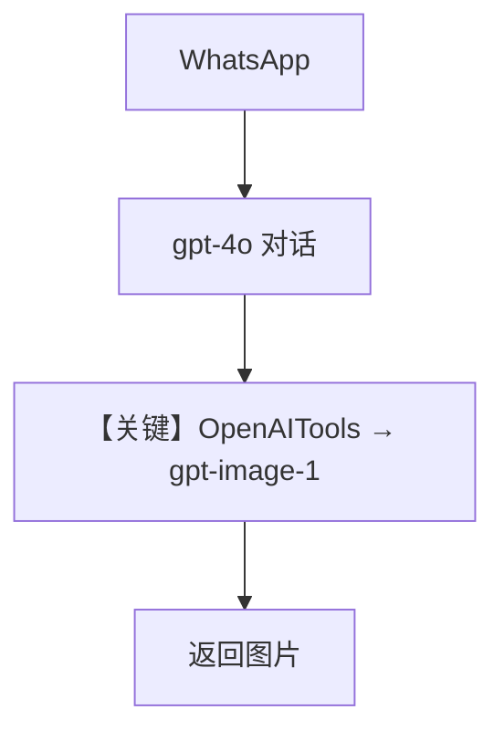

# image_generation_tools.py — 实现原理分析

> 源文件：`cookbook/05_agent_os/interfaces/whatsapp/image_generation_tools.py`

## 概述

本示例展示 Agno 的 **`OpenAITools(image_model=...)` + WhatsApp** 机制：由 **工具** 调用 OpenAI 图像模型（`gpt-image-1`）生成图片，主聊天仍为 `OpenAIChat(gpt-4o)`，适合「对话中按需生图」而非 Gemini 原生多模态一条请求出图。

**核心配置一览：**

| 配置项 | 值 | 说明 |
|--------|------|------|
| `model` | `OpenAIChat(id="gpt-4o")` | 对话 |
| `tools` | `[OpenAITools(image_model="gpt-image-1")]` | 生图工具 |
| `markdown` | `True` | 是 |
| `add_history_to_context` | `True` | 是 |
| `db` | `SqliteDb` | 是 |

## 架构分层

```
用户 → Chat 模型决定是否 tool_call → OpenAITools 调图像 API → 回传 WhatsApp
```

## 核心组件解析

与 `image_generation_model.md` 对比：**工具路径 vs Gemini 模型路径**。

## System Prompt 组装

无显式 `instructions`；工具 schema 进入 `# 3.3.5` 工具说明。

## 完整 API 请求

- 对话轮次：`chat.completions.create`。
- 生图：经 `OpenAITools` 内部调用 OpenAI Images API（以 `agno/tools/openai` 实现为准）。

## Mermaid 流程图



## 关键源码文件索引

| 文件 | 关键函数/类 | 作用 |
|------|------------|------|
| `agno/tools/openai` | `OpenAITools` | 图像工具 |
| `agno/models/openai/chat.py` | `invoke()` | 对话 |
