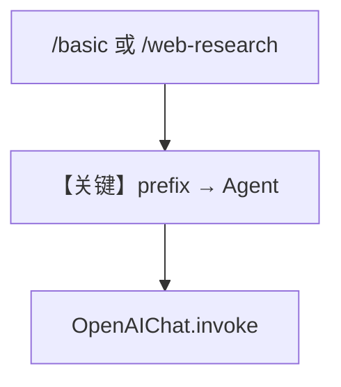

# multiple_instances.py — 实现原理分析

<!-- cookbook-py-source:start -->
## 完整源码

```python
"""
Multiple Instances
==================

Demonstrates multiple instances.
"""

from agno.agent import Agent
from agno.db.sqlite import SqliteDb
from agno.models.openai import OpenAIChat
from agno.os.app import AgentOS
from agno.os.interfaces.whatsapp import Whatsapp
from agno.tools.websearch import WebSearchTools

# ---------------------------------------------------------------------------
# Create Example
# ---------------------------------------------------------------------------

agent_db = SqliteDb(db_file="tmp/persistent_memory.db")

basic_agent = Agent(
    name="Basic Agent",
    model=OpenAIChat(id="gpt-5.2"),
    db=agent_db,
    add_history_to_context=True,
    num_history_runs=3,
    add_datetime_to_context=True,
    markdown=True,
)

web_research_agent = Agent(
    name="Web Research Agent",
    model=OpenAIChat(id="gpt-5.2"),
    db=agent_db,
    tools=[WebSearchTools()],
    add_history_to_context=True,
    num_history_runs=3,
    add_datetime_to_context=True,
)

# Setup our AgentOS app
agent_os = AgentOS(
    agents=[basic_agent, web_research_agent],
    interfaces=[
        Whatsapp(agent=basic_agent, prefix="/basic"),
        Whatsapp(agent=web_research_agent, prefix="/web-research"),
    ],
)
app = agent_os.get_app()


# ---------------------------------------------------------------------------
# Run Example
# ---------------------------------------------------------------------------

if __name__ == "__main__":
    """Run your AgentOS.

    You can see the configuration and available apps at:
    http://localhost:7777/config

    """
    agent_os.serve(app="basic:app", reload=True)
```

<!-- cookbook-py-source:end -->

> 源文件：`cookbook/05_agent_os/interfaces/whatsapp/multiple_instances.py`

## 概述

本示例展示 Agno 的 **WhatsApp 双 Agent + prefix 路由** 机制：与 AGUI `multiple_instances` 类似，`Whatsapp(agent=..., prefix="/basic")` 与 `prefix="/web-research"` 区分聊天与研究机器人，共享 `SqliteDb`。

**核心配置一览：**

| 配置项 | 值 | 说明 |
|--------|------|------|
| `basic_agent` | `gpt-5.2`，无 tools | 通用 |
| `web_research_agent` | `gpt-5.2` + `WebSearchTools` | 检索 |
| `Whatsapp`×2 | `prefix` 不同 |  |

## 架构分层

```
不同 webhook 路径 → 不同 Agent → OpenAIChat
```

## 备注

`if __name__` 中 `serve(app="basic:app", ...)` 与文件名 `multiple_instances` 不一致，若以模块运行需与实际 `app` 导出一致（以用户本地修正为准）。

## System Prompt 组装

`web_research_agent` 无显式 instructions，含工具说明；`basic_agent` 同默认。

## 完整 API 请求

`chat.completions.create`，研究 Agent 带 `tools`。

## Mermaid 流程图



## 关键源码文件索引

| 文件 | 关键函数/类 | 作用 |
|------|------------|------|
| `agno/os/interfaces/whatsapp` | `Whatsapp(prefix)` | 多实例 |
