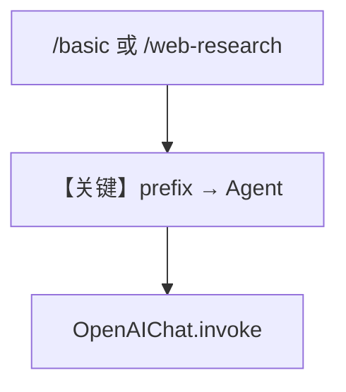

# multiple_instances.py — 实现原理分析

> 源文件：`cookbook/05_agent_os/interfaces/whatsapp/multiple_instances.py`

## 概述

本示例展示 Agno 的 **WhatsApp 双 Agent + prefix 路由** 机制：与 AGUI `multiple_instances` 类似，`Whatsapp(agent=..., prefix="/basic")` 与 `prefix="/web-research"` 区分聊天与研究机器人，共享 `SqliteDb`。

**核心配置一览：**

| 配置项 | 值 | 说明 |
|--------|------|------|
| `basic_agent` | `gpt-5.2`，无 tools | 通用 |
| `web_research_agent` | `gpt-5.2` + `WebSearchTools` | 检索 |
| `Whatsapp`×2 | `prefix` 不同 |  |

## 架构分层

```
不同 webhook 路径 → 不同 Agent → OpenAIChat
```

## 备注

`if __name__` 中 `serve(app="basic:app", ...)` 与文件名 `multiple_instances` 不一致，若以模块运行需与实际 `app` 导出一致（以用户本地修正为准）。

## System Prompt 组装

`web_research_agent` 无显式 instructions，含工具说明；`basic_agent` 同默认。

## 完整 API 请求

`chat.completions.create`，研究 Agent 带 `tools`。

## Mermaid 流程图



## 关键源码文件索引

| 文件 | 关键函数/类 | 作用 |
|------|------------|------|
| `agno/os/interfaces/whatsapp` | `Whatsapp(prefix)` | 多实例 |
