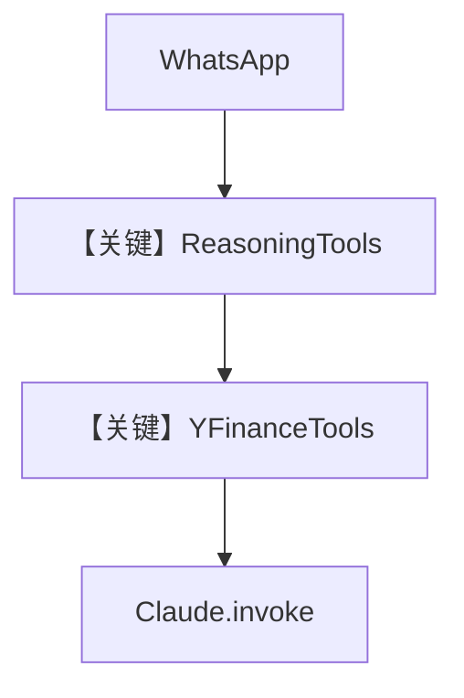

# reasoning_agent.py — 实现原理分析

> 源文件：`cookbook/05_agent_os/interfaces/whatsapp/reasoning_agent.py`

## 概述

本示例展示 Agno 的 **WhatsApp + Claude + ReasoningTools + YFinanceTools** 机制：与 Slack `reasoning_agent` 同属金融推理场景，但工具为 **YFinanceTools**（非 WebSearch），模型为 `Claude(id="claude-3-7-sonnet-latest")`。

**核心配置一览：**

| 配置项 | 值 | 说明 |
|--------|------|------|
| `model` | `Claude(id="claude-3-7-sonnet-latest")` | Anthropic |
| `tools` | `[ReasoningTools(add_instructions=True), YFinanceTools()]` | 推理+行情 |
| `instructions` | 单行（表格、思考简短） |  |

## 架构分层

```
WhatsApp → Agent → Claude Messages API + tools
```

## System Prompt 组装

### 还原后的 instructions 字面量

```text
Use tables to display data. When you use thinking tools, keep the thinking brief.
```

## 完整 API 请求

`Claude.invoke`，tools 含 reasoning 与 yfinance 函数定义。

## Mermaid 流程图



## 关键源码文件索引

| 文件 | 关键函数/类 | 作用 |
|------|------------|------|
| `agno/tools/reasoning` | `ReasoningTools` | 思考 |
| `agno/tools/yfinance` | `YFinanceTools` | 金融数据 |
| `agno/models/anthropic/claude.py` | `invoke()` | API |
