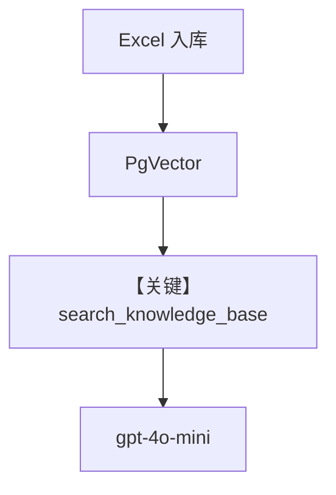

# agentos_excel_analyst.py — 实现原理分析

> 源文件：`cookbook/05_agent_os/knowledge/agentos_excel_analyst.py`

## 概述

本示例展示 Agno 的 **AgentOS + Postgres/PgVector + ExcelReader 入库 + 检索问答** 机制：`Knowledge` 指向 `contents_db` 与 `PgVector`，启动时用 `ExcelReader` 将 `sample_products.xlsx` 写入向量库；Agent 显式 `search_knowledge=True`，面向表格数据问答。

**核心配置一览：**

| 配置项 | 值 | 说明 |
|--------|------|------|
| `db` | `PostgresDb` | 会话与内容元数据 |
| `knowledge` | `Knowledge` + `PgVector(table_name=agentos_excel_knowledge)` | 向量检索 |
| `search_knowledge` | `True` | 启用检索与 `search_knowledge_base` 工具 |
| `model` | `OpenAIChat(id="gpt-4o-mini")` | Chat Completions |
| `instructions` | 多行 | 分析师角色 |

## 架构分层

```
Excel → knowledge.insert(reader=ExcelReader) → PgVector
用户请求 → Agent → search_knowledge_base / hybrid → LLM 回答
```

## 运行机制与因果链

1. **入库**：`insert(path=..., reader=ExcelReader(), skip_if_exists=True)`。
2. **检索**：`# 3.3.13` 将 knowledge `build_context` 拼入 system；默认工具 `search_knowledge_base`（`_default_tools.py`）。

## System Prompt 组装

### 还原后的 instructions 字面量

```text
You are a data analyst assistant with access to Excel spreadsheet data.
Search the knowledge base to answer questions about the data.
Provide specific numbers and details when available.
```

## 完整 API 请求

`OpenAIChat.invoke`，含 tools（含 `search_knowledge_base`）与检索结果注入。

## Mermaid 流程图



## 关键源码文件索引

| 文件 | 关键函数/类 | 作用 |
|------|------------|------|
| `agno/knowledge/reader/excel_reader.py` | `ExcelReader` | 表格解析 |
| `agno/agent/_default_tools.py` | `search_knowledge_base` | 检索工具 |
| `agno/agent/_messages.py` | `# 3.3.13` | 知识段 |
