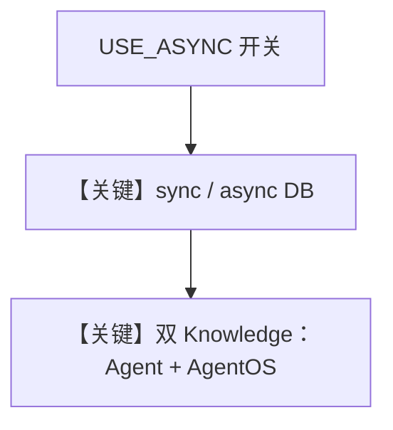

# agentos_knowledge.py — 实现原理分析

> 源文件：`cookbook/05_agent_os/knowledge/agentos_knowledge.py`

## 概述

本示例展示 Agno 的 **同步 vs 异步 Postgres + 双 Knowledge 源（文档 + FAQ）+ AgentOS.knowledge 列表** 机制：通过 `USE_ASYNC` 切换 `PostgresDb` / `AsyncPostgresDb` 与 `ainsert` / `insert`；`AgentOS(..., knowledge=[sync_faq_knowledge])` 将 FAQ 知识库挂到 OS 层，Agent 侧绑定文档向量库。

**核心配置一览：**

| 配置项 | 值 | 说明 |
|--------|------|------|
| `sync_documents_knowledge` / `async_documents_knowledge` | `PgVector` hybrid + `OpenAIEmbedder` | 文档向量 |
| `sync_faq_knowledge` / `async_faq_knowledge` | 另一 `contents_db` 表 | FAQ |
| `sync_knowledge_agent` | `knowledge=sync_documents_knowledge`, `db=sync_documents_db` |  |
| `agent_os` | `knowledge=[sync_faq_knowledge]` | OS 级知识 |
| `search_knowledge` | `True` | 是 |

## 架构分层

```
insert/ainsert → 多表 Postgres + PgVector
Agent.run → 检索文档；OS 层 knowledge 供 API/UI 发现
```

## 运行机制与因果链

- **`USE_ASYNC=False`**：`sync_*` + `insert`。
- **`USE_ASYNC=True`**：`async_*` + `asyncio.run(ainsert(...))`。

## System Prompt 组装

### 还原后的 instructions 字面量

```text
You are a helpful assistant with access to Agno documentation.
Search the knowledge base to answer questions about Agno.
```

FAQ 插入文本含 `What is Agno?` 等（`dedent` 块）。

## 完整 API 请求

`OpenAIChat.invoke` + 检索工具循环。

## Mermaid 流程图



## 关键源码文件索引

| 文件 | 关键函数/类 | 作用 |
|------|------------|------|
| `agno/db/postgres.py` | `PostgresDb` / `AsyncPostgresDb` | 存储 |
| `agno/os/__init__.py` | `AgentOS(knowledge=...)` | OS 知识 |
