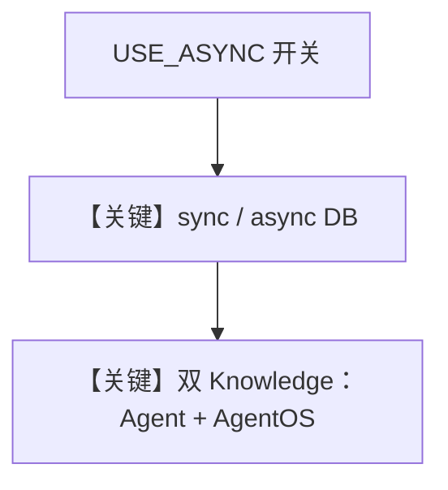

# agentos_knowledge.py — 实现原理分析

<!-- cookbook-py-source:start -->
## 完整源码

```python
"""
AgentOS Knowledge (Sync And Async)
==================================

Demonstrates AgentOS knowledge integration with both sync and async database setups.
"""

import asyncio
from textwrap import dedent

from agno.agent import Agent
from agno.db.postgres import AsyncPostgresDb, PostgresDb
from agno.knowledge.embedder.openai import OpenAIEmbedder
from agno.knowledge.knowledge import Knowledge
from agno.models.openai import OpenAIChat
from agno.os import AgentOS
from agno.vectordb.pgvector import PgVector, SearchType

# ---------------------------------------------------------------------------
# Setup
# ---------------------------------------------------------------------------
USE_ASYNC = False

db_url = "postgresql+psycopg://ai:ai@localhost:5532/ai"

sync_documents_db = PostgresDb(
    db_url=db_url,
    id="agno_knowledge_db",
    knowledge_table="agno_knowledge_contents",
)
sync_faq_db = PostgresDb(
    db_url=db_url,
    id="agno_faq_db",
    knowledge_table="agno_faq_contents",
)

async_documents_db = AsyncPostgresDb(
    db_url=db_url,
    id="agno_knowledge_db",
    knowledge_table="agno_knowledge_contents",
)
async_faq_db = AsyncPostgresDb(
    db_url=db_url,
    id="agno_faq_db",
    knowledge_table="agno_faq_contents",
)

sync_documents_knowledge = Knowledge(
    vector_db=PgVector(
        db_url=db_url,
        table_name="agno_knowledge_vectors",
        search_type=SearchType.hybrid,
        embedder=OpenAIEmbedder(id="text-embedding-3-small"),
    ),
    contents_db=sync_documents_db,
)

sync_faq_knowledge = Knowledge(
    vector_db=PgVector(
        db_url=db_url,
        table_name="agno_faq_vectors",
        search_type=SearchType.hybrid,
        embedder=OpenAIEmbedder(id="text-embedding-3-small"),
    ),
    contents_db=sync_faq_db,
)

async_documents_knowledge = Knowledge(
    vector_db=PgVector(
        db_url=db_url,
        table_name="agno_knowledge_vectors",
        search_type=SearchType.hybrid,
        embedder=OpenAIEmbedder(id="text-embedding-3-small"),
    ),
    contents_db=async_documents_db,
)

async_faq_knowledge = Knowledge(
    vector_db=PgVector(
        db_url=db_url,
        table_name="agno_faq_vectors",
        search_type=SearchType.hybrid,
        embedder=OpenAIEmbedder(id="text-embedding-3-small"),
    ),
    contents_db=async_faq_db,
)

# ---------------------------------------------------------------------------
# Create Agents
# ---------------------------------------------------------------------------
sync_knowledge_agent = Agent(
    name="Knowledge Agent",
    model=OpenAIChat(id="gpt-4o-mini"),
    knowledge=sync_documents_knowledge,
    search_knowledge=True,
    db=sync_documents_db,
    enable_user_memories=True,
    add_history_to_context=True,
    markdown=True,
    instructions=[
        "You are a helpful assistant with access to Agno documentation.",
        "Search the knowledge base to answer questions about Agno.",
    ],
)

async_knowledge_agent = Agent(
    name="Knowledge Agent",
    model=OpenAIChat(id="gpt-4o-mini"),
    knowledge=async_documents_knowledge,
    search_knowledge=True,
    db=async_documents_db,
    enable_user_memories=True,
    add_history_to_context=True,
    markdown=True,
    instructions=[
        "You are a helpful assistant with access to Agno documentation.",
        "Search the knowledge base to answer questions about Agno.",
    ],
)

# ---------------------------------------------------------------------------
# Create AgentOS
# ---------------------------------------------------------------------------
sync_agent_os = AgentOS(
    description="Example app with AgentOS Knowledge",
    agents=[sync_knowledge_agent],
    knowledge=[sync_faq_knowledge],
)

async_agent_os = AgentOS(
    description="Example app with AgentOS Knowledge (Async)",
    agents=[async_knowledge_agent],
    knowledge=[async_faq_knowledge],
)

agent_os = async_agent_os if USE_ASYNC else sync_agent_os
app = agent_os.get_app()

# ---------------------------------------------------------------------------
# Run
# ---------------------------------------------------------------------------
if __name__ == "__main__":
    if USE_ASYNC:
        asyncio.run(
            async_documents_knowledge.ainsert(
                name="Agno Docs",
                url="https://docs.agno.com/llms-full.txt",
                skip_if_exists=True,
            )
        )
        asyncio.run(
            async_faq_knowledge.ainsert(
                name="Agno FAQ",
                text_content=dedent("""
                What is Agno?
                Agno is a framework for building agents.
                Use it to build multi-agent systems with memory, knowledge,
                human in the loop and MCP support.
            """),
                skip_if_exists=True,
            )
        )
    else:
        sync_documents_knowledge.insert(
            name="Agno Docs",
            url="https://docs.agno.com/llms-full.txt",
            skip_if_exists=True,
        )
        sync_faq_knowledge.insert(
            name="Agno FAQ",
            text_content=dedent("""
            What is Agno?
            Agno is a framework for building agents.
            Use it to build multi-agent systems with memory, knowledge,
            human in the loop and MCP support.
        """),
            skip_if_exists=True,
        )

    agent_os.serve(app="agentos_knowledge:app", reload=True)
```

<!-- cookbook-py-source:end -->

> 源文件：`cookbook/05_agent_os/knowledge/agentos_knowledge.py`

## 概述

本示例展示 Agno 的 **同步 vs 异步 Postgres + 双 Knowledge 源（文档 + FAQ）+ AgentOS.knowledge 列表** 机制：通过 `USE_ASYNC` 切换 `PostgresDb` / `AsyncPostgresDb` 与 `ainsert` / `insert`；`AgentOS(..., knowledge=[sync_faq_knowledge])` 将 FAQ 知识库挂到 OS 层，Agent 侧绑定文档向量库。

**核心配置一览：**

| 配置项 | 值 | 说明 |
|--------|------|------|
| `sync_documents_knowledge` / `async_documents_knowledge` | `PgVector` hybrid + `OpenAIEmbedder` | 文档向量 |
| `sync_faq_knowledge` / `async_faq_knowledge` | 另一 `contents_db` 表 | FAQ |
| `sync_knowledge_agent` | `knowledge=sync_documents_knowledge`, `db=sync_documents_db` |  |
| `agent_os` | `knowledge=[sync_faq_knowledge]` | OS 级知识 |
| `search_knowledge` | `True` | 是 |

## 架构分层

```
insert/ainsert → 多表 Postgres + PgVector
Agent.run → 检索文档；OS 层 knowledge 供 API/UI 发现
```

## 运行机制与因果链

- **`USE_ASYNC=False`**：`sync_*` + `insert`。
- **`USE_ASYNC=True`**：`async_*` + `asyncio.run(ainsert(...))`。

## System Prompt 组装

### 还原后的 instructions 字面量

```text
You are a helpful assistant with access to Agno documentation.
Search the knowledge base to answer questions about Agno.
```

FAQ 插入文本含 `What is Agno?` 等（`dedent` 块）。

## 完整 API 请求

`OpenAIChat.invoke` + 检索工具循环。

## Mermaid 流程图



## 关键源码文件索引

| 文件 | 关键函数/类 | 作用 |
|------|------------|------|
| `agno/db/postgres.py` | `PostgresDb` / `AsyncPostgresDb` | 存储 |
| `agno/os/__init__.py` | `AgentOS(knowledge=...)` | OS 知识 |
