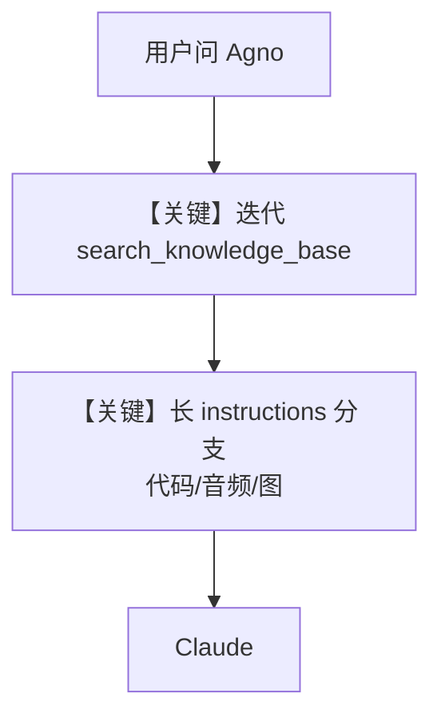

# agno_docs_agent.md — 实现原理分析

> 源文件：`cookbook/05_agent_os/knowledge/agno_docs_agent.py`

## 概述

本示例展示 Agno 的 **长程 instructions（AgnoAssist）+ Claude + 混合检索 + 记忆** 机制：`description` 与 `instructions` 定义多步骤（分析→迭代 `search_knowledge_base`→代码示例→音频→配图）；`knowledge.insert` 拉取 `llms-full.txt`；`update_memory_on_run=True` 持久用户偏好。

**核心配置一览：**

| 配置项 | 值 | 说明 |
|--------|------|------|
| `model` | `Claude(id="claude-sonnet-4-0")` | Anthropic |
| `description` / `instructions` | 长 `dedent` 块 | 核心行为 |
| `knowledge` | `PgVector` hybrid + `contents_db` | 文档检索 |
| `search_knowledge` | `True` | 默认 `search_knowledge_base` 工具 |
| `update_memory_on_run` | `True` | 记忆更新 |

## 核心组件解析

`instructions` 中提及 **ElevenLabs**、**DALL-E `create_image`**：本文件 **未** 在 `Agent(..., tools=[...])` 中挂载对应 Toolkit；若需真实调用，须在 Agent 上添加 `ElevenLabsTools`、`DalleTools` 等。`search_knowledge_base` 由 `search_knowledge=True` 提供。

## System Prompt 组装

须完整还原 `description` 与 `instructions` — 篇幅极长，见源文件 L29-97；文档此处不重复粘贴第二遍，**静态分析以源文件为准**。

### 拼装顺序

走 `get_system_message()`：`# 3.3.1` description → `# 3.3.3` instructions → `# 3.3.13` knowledge 段 → memories 等。

## 完整 API 请求

`Claude.invoke`，tools 至少含 `search_knowledge_base`；其余能力依赖是否扩展 `tools`。

## Mermaid 流程图

## 关键源码文件索引

| 文件 | 关键函数/类 | 作用 |
|------|------------|------|
| `agno/agent/_default_tools.py` | `search_knowledge_base` | 检索 |
| `agno/agent/_messages.py` | `# 3.3.13` | 知识段 |
