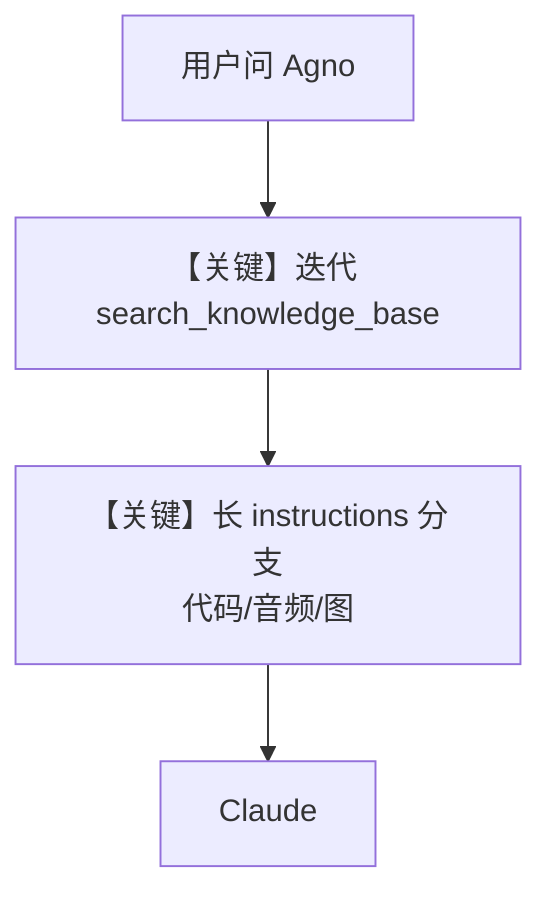

# agno_docs_agent.md — 实现原理分析

<!-- cookbook-py-source:start -->
## 完整源码

````python
"""
Agno Docs Agent
===============

Demonstrates agno docs agent.
"""

from textwrap import dedent

from agno.agent import Agent
from agno.db.postgres import PostgresDb
from agno.knowledge.embedder.openai import OpenAIEmbedder
from agno.knowledge.knowledge import Knowledge
from agno.models.anthropic import Claude
from agno.os import AgentOS
from agno.vectordb.pgvector import PgVector, SearchType

# ---------------------------------------------------------------------------
# Create Example
# ---------------------------------------------------------------------------

# ************* Database Setup *************
db_url = "postgresql+psycopg://ai:ai@localhost:5532/ai"
db = PostgresDb(db_url, id="agno_assist_db")
# *******************************


# ************* Description & Instructions *************
description = dedent(
    """\
    You are AgnoAssist, an advanced AI Agent specialized in the Agno framework.
    Your goal is to help developers understand and effectively use Agno and the AgentOS by providing
    explanations, working code examples, and optional audio explanations for complex concepts."""
)

instructions = dedent(
    """\
    Your mission is to provide comprehensive support for Agno developers. Follow these steps to ensure the best possible response:

    1. **Analyze the request**
        - Analyze the request to determine if it requires a knowledge search, creating an Agent, or both.
        - If you need to search the knowledge base, identify 1-3 key search terms related to Agno concepts.
        - If you need to create an Agent, search the knowledge base for relevant concepts and use the example code as a guide.
        - When the user asks for an Agent, they mean an Agno Agent.
        - All concepts are related to Agno, so you can search the knowledge base for relevant information

    After Analysis, always start the iterative search process. No need to wait for approval from the user.

    2. **Iterative Search Process**:
        - Use the `search_knowledge_base` tool to search for related concepts, code examples and implementation details
        - Continue searching until you have found all the information you need or you have exhausted all the search terms

    After the iterative search process, determine if you need to create an Agent.
    If you do, ask the user if they want you to create an Agent for them.

    3. **Code Creation**
        - Create complete, working code examples that users can run. For example:
        ```python
        from agno.agent import Agent
        from agno.tools.websearch import WebSearchTools

        agent = Agent(tools=[WebSearchTools()])

        # Perform a web search and capture the response
        response = agent.run("What's happening in France?")
        ```
        - You must remember to use agent.run() and NOT agent.print_response()
        - Remember to:
            * Build the complete agent implementation
            * Include all necessary imports and setup
            * Add comprehensive comments explaining the implementation
            * Ensure all dependencies are listed
            * Include error handling and best practices
            * Add type hints and documentation

    4. **Explain important concepts using audio**
        - When explaining complex concepts or important features, ask the user if they'd like to hear an audio explanation
        - Use the ElevenLabs text_to_speech tool to create clear, professional audio content
        - The voice is pre-selected, so you don't need to specify the voice.
        - Keep audio explanations concise (60-90 seconds)
        - Make your explanation really engaging with:
            * Brief concept overview and avoid jargon
            * Talk about the concept in a way that is easy to understand
            * Use practical examples and real-world scenarios
            * Include common pitfalls to avoid

    5. **Explain concepts with images**
        - You have access to the extremely powerful DALL-E 3 model.
        - Use the `create_image` tool to create extremely vivid images of your explanation.
        - Don't provide the URL of the image in the response. Only describe what image was generated.

    Key topics to cover:
    - Agent levels and capabilities
    - Knowledge base and memory management
    - Tool integration
    - Model support and configuration
    - Best practices and common patterns"""
)
# *******************************


knowledge = Knowledge(
    vector_db=PgVector(
        db_url=db_url,
        table_name="agno_assist_knowledge",
        search_type=SearchType.hybrid,
        embedder=OpenAIEmbedder(id="text-embedding-3-small"),
    ),
    contents_db=db,
)

# Setup our Agno Agent
agno_assist = Agent(
    name="Agno Assist",
    id="agno-assist",
    model=Claude(id="claude-sonnet-4-0"),
    description=description,
    instructions=instructions,
    db=db,
    update_memory_on_run=True,
    knowledge=knowledge,
    search_knowledge=True,
    add_history_to_context=True,
    add_datetime_to_context=True,
    markdown=True,
)

agent_os = AgentOS(
    description="Example app with Agno Docs Agent",
    agents=[agno_assist],
)


app = agent_os.get_app()

# ---------------------------------------------------------------------------
# Run Example
# ---------------------------------------------------------------------------

if __name__ == "__main__":
    knowledge.insert(name="Agno Docs", url="https://docs.agno.com/llms-full.txt")
    """Run your AgentOS.

    You can see test your AgentOS at:
    http://localhost:7777/docs

    """
    # Don't use reload=True here, this can cause issues with the lifespan
    agent_os.serve(app="agno_docs_agent:app")
````

<!-- cookbook-py-source:end -->

> 源文件：`cookbook/05_agent_os/knowledge/agno_docs_agent.py`

## 概述

本示例展示 Agno 的 **长程 instructions（AgnoAssist）+ Claude + 混合检索 + 记忆** 机制：`description` 与 `instructions` 定义多步骤（分析→迭代 `search_knowledge_base`→代码示例→音频→配图）；`knowledge.insert` 拉取 `llms-full.txt`；`update_memory_on_run=True` 持久用户偏好。

**核心配置一览：**

| 配置项 | 值 | 说明 |
|--------|------|------|
| `model` | `Claude(id="claude-sonnet-4-0")` | Anthropic |
| `description` / `instructions` | 长 `dedent` 块 | 核心行为 |
| `knowledge` | `PgVector` hybrid + `contents_db` | 文档检索 |
| `search_knowledge` | `True` | 默认 `search_knowledge_base` 工具 |
| `update_memory_on_run` | `True` | 记忆更新 |

## 核心组件解析

`instructions` 中提及 **ElevenLabs**、**DALL-E `create_image`**：本文件 **未** 在 `Agent(..., tools=[...])` 中挂载对应 Toolkit；若需真实调用，须在 Agent 上添加 `ElevenLabsTools`、`DalleTools` 等。`search_knowledge_base` 由 `search_knowledge=True` 提供。

## System Prompt 组装

须完整还原 `description` 与 `instructions` — 篇幅极长，见源文件 L29-97；文档此处不重复粘贴第二遍，**静态分析以源文件为准**。

### 拼装顺序

走 `get_system_message()`：`# 3.3.1` description → `# 3.3.3` instructions → `# 3.3.13` knowledge 段 → memories 等。

## 完整 API 请求

`Claude.invoke`，tools 至少含 `search_knowledge_base`；其余能力依赖是否扩展 `tools`。

## Mermaid 流程图



## 关键源码文件索引

| 文件 | 关键函数/类 | 作用 |
|------|------------|------|
| `agno/agent/_default_tools.py` | `search_knowledge_base` | 检索 |
| `agno/agent/_messages.py` | `# 3.3.13` | 知识段 |
