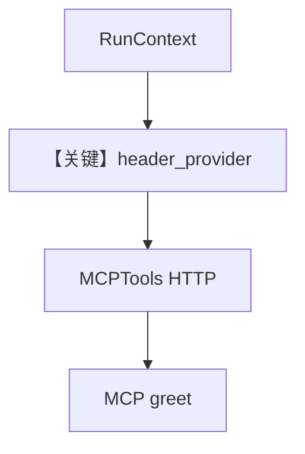

# client.py — 实现原理分析

<!-- cookbook-py-source:start -->
## 完整源码

```python
"""
AgentOS with MCPTools using dynamic headers.

This example shows how to pass user context to external MCP servers.
The header_provider receives run_context, agent, and team - allowing you to
forward user info, session data, or entity names to MCP tools.

Usage:
1. Start the MCP server: python server.py
2. Start AgentOS: python client.py
3. Test at http://localhost:7777/docs
   - Call the standalone agent: POST /agents/greeting-agent/runs
   - Call the team: POST /teams/greeting-team/runs
"""

from typing import TYPE_CHECKING, Optional

from agno.agent import Agent
from agno.db.sqlite import SqliteDb
from agno.models.openai import OpenAIChat
from agno.os import AgentOS
from agno.run import RunContext
from agno.team.team import Team
from agno.tools.mcp import MCPTools

# ---------------------------------------------------------------------------
# Create Example
# ---------------------------------------------------------------------------

if TYPE_CHECKING:
    from agno.agent import Agent as AgentType
    from agno.team.team import Team as TeamType


# We will use this tool to generate headers dinamically for our MCP tools.
def header_provider(
    run_context: RunContext,
    agent: Optional["AgentType"] = None,
    team: Optional["TeamType"] = None,
) -> dict:
    """
    Generate headers from run context to pass to external MCP server.

    When users call the AgentOS API with user_id/session_id, those values
    flow through run_context and get forwarded to the MCP server.
    """
    return {
        "X-User-ID": run_context.user_id or "anonymous",
        "X-Session-ID": run_context.session_id or "unknown",
        "X-Agent-Name": agent.name if agent else "unknown",
        "X-Team-Name": team.name if team else "none",
    }


db = SqliteDb(db_file="tmp/agentos.db")

# MCP tools with dynamic headers - shared by all agents
mcp_tools = MCPTools(
    url="http://localhost:8000/mcp",
    header_provider=header_provider,
)


# Agent with MCP tools
greeting_agent = Agent(
    name="greeting-agent",
    role="Greet users in a friendly, casual manner",
    model=OpenAIChat(id="gpt-5"),
    tools=[mcp_tools],
)

# Team containing multiple agents with MCP tools
greeting_team = Team(
    id="greeting-team",
    model=OpenAIChat(id="gpt-5"),
    members=[greeting_agent],
    instructions="Choose the appropriate greeter based on context. Use the greet tool.",
    db=db,
)

# AgentOS with both standalone agent and team
agent_os = AgentOS(
    description="AgentOS showcasing dynamic headers for MCP tools",
    teams=[greeting_team],
    agents=[greeting_agent],
)

app = agent_os.get_app()

# ---------------------------------------------------------------------------
# Run Example
# ---------------------------------------------------------------------------

if __name__ == "__main__":
    agent_os.serve(app="client:app")
```

<!-- cookbook-py-source:end -->

> 源文件：`cookbook/05_agent_os/mcp_demo/dynamic_headers/client.py`

## 概述

本示例展示 Agno 的 **`MCPTools(header_provider=...)` 动态请求头** 机制：根据 `RunContext.user_id` / `session_id` 与当前 `agent` / `team` 名生成 HTTP 头，转发到外部 MCP（`http://localhost:8000/mcp`），便于多租户与审计；同时注册独立 `greeting_agent` 与含该 agent 的 `greeting_team`。

**核心配置一览：**

| 配置项 | 值 | 说明 |
|--------|------|------|
| `mcp_tools` | `MCPTools(url=..., header_provider=header_provider)` | 动态头 |
| `greeting_agent` | `OpenAIChat(gpt-5)` + `tools=[mcp_tools]` |  |
| `greeting_team` | `Team(members=[greeting_agent], ...)` | 队长模型 gpt-5 |
| `agent_os` | `teams` + `agents` | 双入口 |

## 架构分层

```
API 请求带 user/session → RunContext → header_provider → MCP HTTP 客户端 → server.py greet
```

## 运行机制与因果链

`header_provider`（L36-L51）返回 `X-User-ID` 等；服务端 `server.py` 用 `request.headers.get("x-user-id")` 读取。

## System Prompt 组装

**Agent**：显式 `role`，无长 `instructions`（Team 有短 `instructions`）。

Team 字面量：

```text
Choose the appropriate greeter based on context. Use the greet tool.
```

## 完整 API 请求

- LLM：`OpenAIChat.invoke` + MCP 工具 schema。
- MCP：对 `localhost:8000` 的 streamable-http 调用，带动态头。

## Mermaid 流程图



## 关键源码文件索引

| 文件 | 关键函数/类 | 作用 |
|------|------------|------|
| `agno/tools/mcp` | `MCPTools` | MCP 客户端 |
| `agno/run` | `RunContext` | 上下文 |
