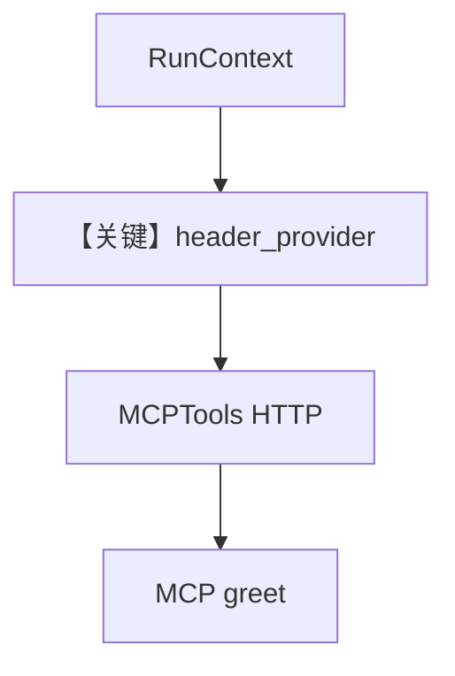

# client.py — 实现原理分析

> 源文件：`cookbook/05_agent_os/mcp_demo/dynamic_headers/client.py`

## 概述

本示例展示 Agno 的 **`MCPTools(header_provider=...)` 动态请求头** 机制：根据 `RunContext.user_id` / `session_id` 与当前 `agent` / `team` 名生成 HTTP 头，转发到外部 MCP（`http://localhost:8000/mcp`），便于多租户与审计；同时注册独立 `greeting_agent` 与含该 agent 的 `greeting_team`。

**核心配置一览：**

| 配置项 | 值 | 说明 |
|--------|------|------|
| `mcp_tools` | `MCPTools(url=..., header_provider=header_provider)` | 动态头 |
| `greeting_agent` | `OpenAIChat(gpt-5)` + `tools=[mcp_tools]` |  |
| `greeting_team` | `Team(members=[greeting_agent], ...)` | 队长模型 gpt-5 |
| `agent_os` | `teams` + `agents` | 双入口 |

## 架构分层

```
API 请求带 user/session → RunContext → header_provider → MCP HTTP 客户端 → server.py greet
```

## 运行机制与因果链

`header_provider`（L36-L51）返回 `X-User-ID` 等；服务端 `server.py` 用 `request.headers.get("x-user-id")` 读取。

## System Prompt 组装

**Agent**：显式 `role`，无长 `instructions`（Team 有短 `instructions`）。

Team 字面量：

```text
Choose the appropriate greeter based on context. Use the greet tool.
```

## 完整 API 请求

- LLM：`OpenAIChat.invoke` + MCP 工具 schema。
- MCP：对 `localhost:8000` 的 streamable-http 调用，带动态头。

## Mermaid 流程图



## 关键源码文件索引

| 文件 | 关键函数/类 | 作用 |
|------|------------|------|
| `agno/tools/mcp` | `MCPTools` | MCP 客户端 |
| `agno/run` | `RunContext` | 上下文 |
