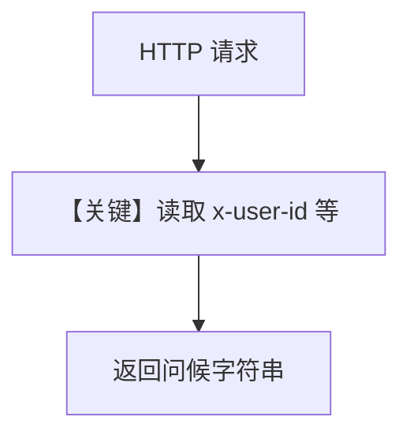

# server.py — 实现原理分析

> 源文件：`cookbook/05_agent_os/mcp_demo/dynamic_headers/server.py`

## 概述

本示例为 **独立 MCP 服务端**（非 AgentOS）：用 `FastMCP` 注册 `greet` 工具，从 HTTP 请求头读取 `client.py` 注入的 `x-user-id`、`x-session-id`、`x-agent-name`、`x-team-name` 并打印日志，验证 **动态头贯穿 MCP 调用链**。

**核心配置一览：**

| 配置项 | 值 | 说明 |
|--------|------|------|
| 框架 | `FastMCP` | MCP 服务 |
| 传输 | `streamable-http`，`port=8000` | 与 client URL 对齐 |
| `greet` | 读 header + 返回问候串 | 演示 |

## 架构分层

```
MCP 客户端（Agno MCPTools）→ HTTP → FastMCP → greet()
```

## System Prompt 组装

无 Agent：本节说明 **不存在** `get_system_message`；仅有 MCP 工具语义在 MCP 协议层描述。

## 完整 API 请求

MCP JSON-RPC / streamable-http（以 FastMCP 为准），非 OpenAI chat。

## Mermaid 流程图



## 关键源码文件索引

| 文件 | 关键函数/类 | 作用 |
|------|------------|------|
| `fastmcp` | `FastMCP` | MCP 服务 |
