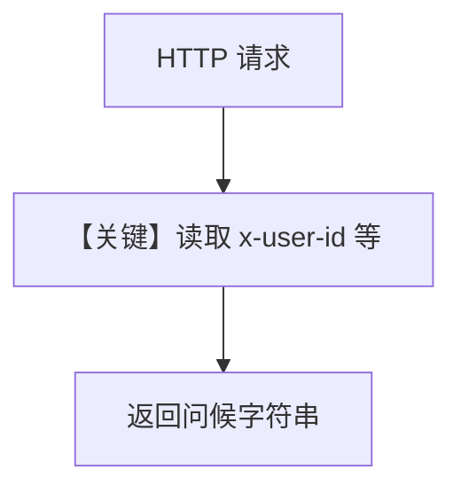

# server.py — 实现原理分析

<!-- cookbook-py-source:start -->
## 完整源码

```python
"""
Simple MCP server that logs headers received from clients.

Run with: python server.py
"""

from fastmcp import FastMCP
from fastmcp.server import Context
from fastmcp.server.dependencies import get_http_request

# ---------------------------------------------------------------------------
# Create Example
# ---------------------------------------------------------------------------

mcp = FastMCP("Dynamic Headers Demo Server")


@mcp.tool
async def greet(name: str, ctx: Context) -> str:
    """Greet a user with personalized information from headers."""
    request = get_http_request()

    # Access headers (lowercase)
    user_id = request.headers.get("x-user-id", "unknown")
    session_id = request.headers.get("x-session-id", "unknown")
    agent_name = request.headers.get("x-agent-name", "unknown")
    team_name = request.headers.get("x-team-name", "none")

    print("=" * 60)
    print(
        f"Headers -> User: {user_id} | Session: {session_id} | Agent: {agent_name} | Team: {team_name}"
    )
    print("=" * 60)

    return f"Hello, {name}! (User: {user_id}, Agent: {agent_name}, Team: {team_name})"


# ---------------------------------------------------------------------------
# Run Example
# ---------------------------------------------------------------------------

if __name__ == "__main__":
    mcp.run(transport="streamable-http", port=8000)
```

<!-- cookbook-py-source:end -->

> 源文件：`cookbook/05_agent_os/mcp_demo/dynamic_headers/server.py`

## 概述

本示例为 **独立 MCP 服务端**（非 AgentOS）：用 `FastMCP` 注册 `greet` 工具，从 HTTP 请求头读取 `client.py` 注入的 `x-user-id`、`x-session-id`、`x-agent-name`、`x-team-name` 并打印日志，验证 **动态头贯穿 MCP 调用链**。

**核心配置一览：**

| 配置项 | 值 | 说明 |
|--------|------|------|
| 框架 | `FastMCP` | MCP 服务 |
| 传输 | `streamable-http`，`port=8000` | 与 client URL 对齐 |
| `greet` | 读 header + 返回问候串 | 演示 |

## 架构分层

```
MCP 客户端（Agno MCPTools）→ HTTP → FastMCP → greet()
```

## System Prompt 组装

无 Agent：本节说明 **不存在** `get_system_message`；仅有 MCP 工具语义在 MCP 协议层描述。

## 完整 API 请求

MCP JSON-RPC / streamable-http（以 FastMCP 为准），非 OpenAI chat。

## Mermaid 流程图



## 关键源码文件索引

| 文件 | 关键函数/类 | 作用 |
|------|------------|------|
| `fastmcp` | `FastMCP` | MCP 服务 |
