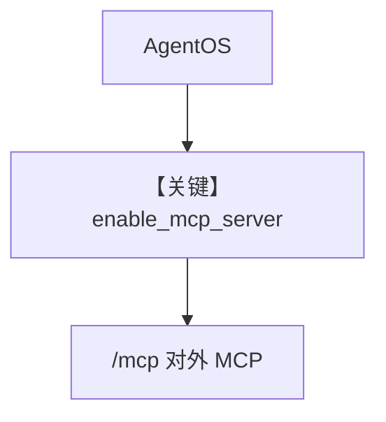

# enable_mcp_example.py — 实现原理分析

<!-- cookbook-py-source:start -->
## 完整源码

```python
"""
Example AgentOS app with MCP enabled.

After starting this AgentOS app, you can test the MCP server with the test_client.py file.
"""

from agno.agent import Agent
from agno.db.sqlite import SqliteDb
from agno.models.anthropic import Claude
from agno.os import AgentOS
from agno.tools.websearch import WebSearchTools

# ---------------------------------------------------------------------------
# Create Example
# ---------------------------------------------------------------------------

# Setup the database
db = SqliteDb(db_file="tmp/agentos.db")

# Setup basic research agent
web_research_agent = Agent(
    id="web-research-agent",
    name="Web Research Agent",
    model=Claude(id="claude-sonnet-4-0"),
    db=db,
    tools=[WebSearchTools()],
    add_history_to_context=True,
    num_history_runs=3,
    add_datetime_to_context=True,
    enable_session_summaries=True,
    markdown=True,
)


# Setup our AgentOS with MCP enabled
agent_os = AgentOS(
    description="Example app with MCP enabled",
    agents=[web_research_agent],
    enable_mcp_server=True,  # This enables a LLM-friendly MCP server at /mcp
)

app = agent_os.get_app()

# ---------------------------------------------------------------------------
# Run Example
# ---------------------------------------------------------------------------

if __name__ == "__main__":
    """Run your AgentOS.

    You can see view your LLM-friendly MCP server at:
    http://localhost:7777/mcp

    """
    agent_os.serve(app="enable_mcp_example:app")
```

<!-- cookbook-py-source:end -->

> 源文件：`cookbook/05_agent_os/mcp_demo/enable_mcp_example.py`

## 概述

本示例展示 Agno 的 **`AgentOS(enable_mcp_server=True)`** 机制：在现有 AgentOS HTTP 应用上额外暴露 **LLM 可消费的 MCP 端点**（`/mcp`），便于外部客户端（如 `test_client.py`）用 `MCPTools(url="http://localhost:7777/mcp")` 反查 AgentOS 配置。

**核心配置一览：**

| 配置项 | 值 | 说明 |
|--------|------|------|
| `web_research_agent` | `Claude` + `WebSearchTools` | 业务 Agent |
| `enable_mcp_server` | `True` | 内置 MCP |
| `enable_session_summaries` | `True` | 会话摘要 |

## 架构分层

```
AgentOS 应用
  ├ REST 跑 Agent
  └ /mcp 暴露 MCP 服务（与 enable_mcp 注释一致）
```

## System Prompt 组装

Agent 未设显式 `instructions`；含工具与历史、摘要相关默认行为。

## 完整 API 请求

- 对话：`Claude.invoke`。
- MCP：对 `/mcp` 的 MCP 协议请求。

## Mermaid 流程图



## 关键源码文件索引

| 文件 | 关键函数/类 | 作用 |
|------|------------|------|
| `agno/os` | `AgentOS(enable_mcp_server=...)` | MCP 端点 |
