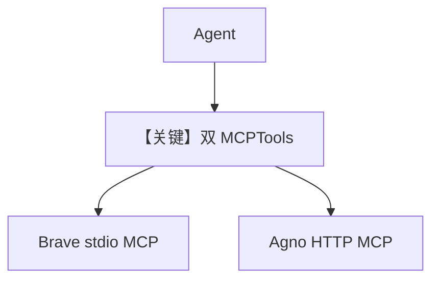

# mcp_tools_advanced_example.py — 实现原理分析

<!-- cookbook-py-source:start -->
## 完整源码

```python
"""
Example AgentOS app where the agent has MCPTools.

AgentOS handles the lifespan of the MCPTools internally.
"""

from os import getenv

from agno.agent import Agent
from agno.db.sqlite import SqliteDb
from agno.models.anthropic import Claude
from agno.os import AgentOS
from agno.tools.mcp import MCPTools  # noqa: F401

# ---------------------------------------------------------------------------
# Create Example
# ---------------------------------------------------------------------------

# Setup the database
db = SqliteDb(db_file="tmp/agentos.db")

agno_mcp_tools = MCPTools(transport="streamable-http", url="https://docs.agno.com/mcp")

# Example: Brave Search MCP server
brave_mcp_tools = MCPTools(
    command="npx -y @modelcontextprotocol/server-brave-search",
    env={
        "BRAVE_API_KEY": getenv("BRAVE_API_KEY"),
    },
    timeout_seconds=60,
)

# You can also use MultiMCPTools to connect to multiple MCP servers at once:
#
# from agno.tools.mcp import MultiMCPTools
# mcp_tools = MultiMCPTools(
#     commands=["npx -y @modelcontextprotocol/server-brave-search"],
#     urls=["https://docs.agno.com/mcp"],
#     env={"BRAVE_API_KEY": getenv("BRAVE_API_KEY")},
# )

# Setup ai framework agent
ai_framework_agent = Agent(
    id="agno-support-agent",
    name="Agno Support Agent",
    model=Claude(id="claude-sonnet-4-0"),
    db=db,
    tools=[brave_mcp_tools, agno_mcp_tools],
    add_history_to_context=True,
    num_history_runs=3,
    markdown=True,
)

agent_os = AgentOS(
    description="Example app with MCP Tools",
    agents=[ai_framework_agent],
)


app = agent_os.get_app()

# ---------------------------------------------------------------------------
# Run Example
# ---------------------------------------------------------------------------

if __name__ == "__main__":
    """Run your AgentOS.

    You can see test your AgentOS at:
    http://localhost:7777/docs

    """
    # Don't use reload=True here, this can cause issues with the lifespan
    agent_os.serve(app="mcp_tools_advanced_example:app")
```

<!-- cookbook-py-source:end -->

> 源文件：`cookbook/05_agent_os/mcp_demo/mcp_tools_advanced_example.py`

## 概述

本示例展示 Agno 的 **多 MCP 源并存**：`MCPTools(transport="streamable-http", url="https://docs.agno.com/mcp")` 与 **stdio** 型 `npx @modelcontextprotocol/server-brave-search`（需 `BRAVE_API_KEY`）；单 Agent 同时挂载两类 `MCPTools`，由模型在运行中选择调用。

**核心配置一览：**

| 配置项 | 值 | 说明 |
|--------|------|------|
| `agno_mcp_tools` | 远程 HTTP MCP | Agno 文档 |
| `brave_mcp_tools` | `command` + `env` | Brave 搜索 |
| `tools` | `[brave_mcp_tools, agno_mcp_tools]` | 多 MCP |
| `model` | `Claude(id="claude-sonnet-4-0")` | Anthropic |

## 运行机制与因果链

AgentOS 管理各 `MCPTools` 生命周期（文件头注释）；**勿** `reload=True` 以免 lifespan 问题。

## System Prompt 组装

无显式 `instructions`；工具定义来自两个 MCP 会话合并。

## 完整 API 请求

`Claude.invoke` + 多 MCP 工具模式。

## Mermaid 流程图



## 关键源码文件索引

| 文件 | 关键函数/类 | 作用 |
|------|------------|------|
| `agno/tools/mcp` | `MCPTools` | 多传输方式 |
