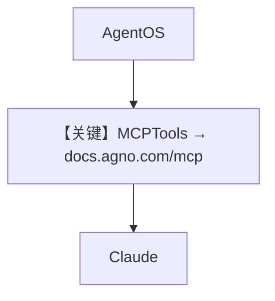

# mcp_tools_example.py — 实现原理分析

> 源文件：`cookbook/05_agent_os/mcp_demo/mcp_tools_example.py`

## 概述

本示例展示 Agno 的 **单远程 MCP（Agno 文档）** 最小集成：`MCPTools(transport="streamable-http", url="https://docs.agno.com/mcp")` 作为唯一工具，Agent 做「Agno 支持」类问答。

**核心配置一览：**

| 配置项 | 值 | 说明 |
|--------|------|------|
| `mcp_tools` | 见上 | 单 HTTP MCP |
| `agno_support_agent` | `Claude` + `tools=[mcp_tools]` |  |
| `add_history_to_context` | `True`，`num_history_runs=3` | 是 |

## 与 advanced 差异

advanced 额外挂载 **Brave** stdio MCP；本文件仅 **一条** MCP URL。

## System Prompt 组装

无自定义 `instructions`；工具能力完全由 MCP schema 决定。

## 完整 API 请求

`Claude.invoke` + MCP 工具。

## Mermaid 流程图

## 关键源码文件索引

| 文件 | 关键函数/类 | 作用 |
|------|------------|------|
| `agno/tools/mcp` | `MCPTools` | 客户端 |
