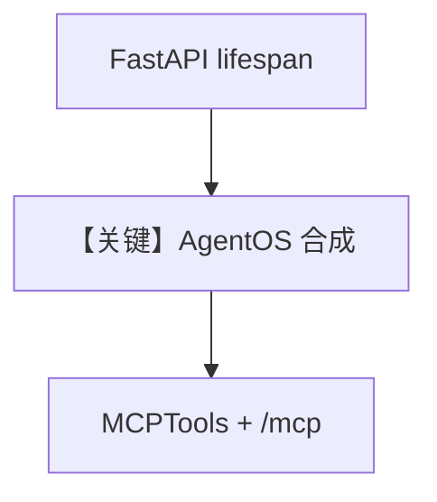

# mcp_tools_existing_lifespan.py — 实现原理分析

> 源文件：`cookbook/05_agent_os/mcp_demo/mcp_tools_existing_lifespan.py`

## 概述

本示例展示 Agno 的 **自定义 FastAPI `lifespan` + `enable_mcp_server=True` + MCPTools** 机制：在 `AgentOS` 上同时传入 `lifespan`（启动/停止日志）与内置 MCP 端点，演示 **与框架默认 lifespan 合成** 时的写法（避免与 `mcp_tools_example` 仅 Agent 的差异）。

**核心配置一览：**

| 配置项 | 值 | 说明 |
|--------|------|------|
| `lifespan` | `asynccontextmanager` 打印日志 | 自定义 |
| `enable_mcp_server` | `True` | 内置 `/mcp` |
| `mcp_tools` | 同 `mcp_tools_example` | 远程文档 MCP |
| `agno_support_agent` | `Claude` + `mcp_tools` |  |

## 运行机制与因果链

`lifespan` 在 app 启动时 `yield` 前后执行；MCP 工具 lifespan 仍由 AgentOS 协调（注释）。

## System Prompt 组装

同 `mcp_tools_example.py`。

## Mermaid 流程图

## 关键源码文件索引

| 文件 | 关键函数/类 | 作用 |
|------|------------|------|
| `agno/os` | `AgentOS(lifespan=..., enable_mcp_server=...)` | 生命周期 |
