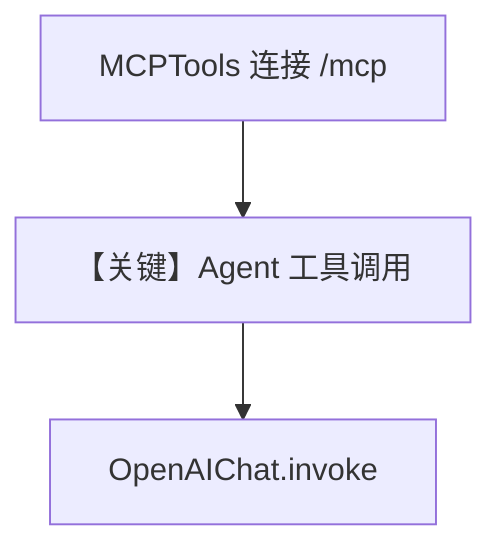

# test_client.py — 实现原理分析

<!-- cookbook-py-source:start -->
## 完整源码

````python
"""
First run the AgentOS with enable_mcp=True

```bash
python cookbook/agent_os/mcp/enable_mcp.py
```
"""

import asyncio
from uuid import uuid4

from agno.agent import Agent
from agno.db.in_memory import InMemoryDb
from agno.models.openai import OpenAIChat
from agno.tools.mcp import MCPTools

# ---------------------------------------------------------------------------
# Create Example
# ---------------------------------------------------------------------------

# This is the URL of the MCP server we want to use.
server_url = "http://localhost:7777/mcp"

session_id = f"session_{uuid4()}"


async def run_agent() -> None:
    async with MCPTools(
        transport="streamable-http", url=server_url, timeout_seconds=60
    ) as mcp_tools:
        agent = Agent(
            model=OpenAIChat(id="gpt-5.2"),
            tools=[mcp_tools],
            instructions=[
                "You are a helpful assistant that has access to the configuration of a AgentOS.",
                "If you are asked to do something, use the appropriate tool to do it. ",
                "Look up information you need in the AgentOS configuration.",
            ],
            user_id="john@example.com",
            session_id=session_id,
            db=InMemoryDb(),
            add_session_state_to_context=True,
            add_history_to_context=True,
            markdown=True,
        )

        await agent.aprint_response(
            input="Which agents do I have in my AgentOS?", stream=True, markdown=True
        )

        # await agent.aprint_response(
        #     input="Use my agent to search the web for the latest news about AI",
        #     stream=True,
        #     markdown=True,
        # )

        ## Memory management
        # await agent.aprint_response(
        #     input="What memories do you have of me?",
        #     stream=True,
        #     markdown=True,
        # )

        # await agent.aprint_response(
        #     input="I like to ski, remember that of me.",
        #     stream=True,
        #     markdown=True,
        # )
        # await agent.aprint_response(
        #     input="Clean up all duplicate memories of me.",
        #     stream=True,
        #     markdown=True,
        # )

        ## Session management
        # await agent.aprint_response(
        #     input="How many sessions does my web-research-agent have?",
        #     stream=True,
        #     markdown=True,
        # )


# Example usage
# ---------------------------------------------------------------------------
# Run Example
# ---------------------------------------------------------------------------

if __name__ == "__main__":
    asyncio.run(run_agent())
````

<!-- cookbook-py-source:end -->

> 源文件：`cookbook/05_agent_os/mcp_demo/test_client.py`

## 概述

本示例展示 **独立 Python 客户端** 通过 `MCPTools(transport="streamable-http", url="http://localhost:7777/mcp")` **消费本机 AgentOS 暴露的 MCP**（需先运行 `enable_mcp_example.py` 等 `enable_mcp_server=True` 的应用）；`async with MCPTools(...) as mcp_tools` 管理会话，**在 `async with` 内创建 Agent** 复用连接（符合「不在循环内重复创建」精神）。

**核心配置一览：**

| 配置项 | 值 | 说明 |
|--------|------|------|
| `server_url` | `http://localhost:7777/mcp` | 目标 MCP |
| `model` | `OpenAIChat(id="gpt-5.2")` | Chat Completions |
| `instructions` | 列表 | 查 AgentOS 配置 |
| `db` | `InMemoryDb()` | 内存会话 |
| `add_session_state_to_context` | `True` | 会话状态进上下文 |

## 架构分层

```
test_client（独立脚本）→ MCP 客户端 → AgentOS /mcp → 工具查询配置
```

## System Prompt 组装

### instructions 字面量

```text
You are a helpful assistant that has access to the configuration of a AgentOS.
If you are asked to do something, use the appropriate tool to do it.
Look up information you need in the AgentOS configuration.
```

## 完整 API 请求

- MCP：对 `7777/mcp` 的 streamable-http。
- LLM：`chat.completions.create`。

## Mermaid 流程图



## 关键源码文件索引

| 文件 | 关键函数/类 | 作用 |
|------|------------|------|
| `agno/tools/mcp` | `MCPTools` 上下文管理器 | 连接 |
