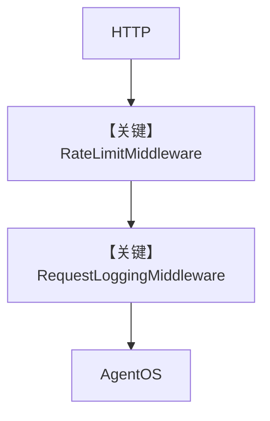

# agent_os_with_custom_middleware.py — 实现原理分析

> 源文件：`cookbook/05_agent_os/middleware/agent_os_with_custom_middleware.py`

## 概述

本示例展示在 **AgentOS 生成的 FastAPI `app` 上 `add_middleware`**：实现 **按 IP 滑动窗口限流**（`RateLimitMiddleware`）与 **请求/响应日志**（`RequestLoggingMiddleware`），在 Agent 逻辑之外做横切控制。

**核心配置一览：**

| 配置项 | 值 | 说明 |
|--------|------|------|
| `agent` | `OpenAIChat(gpt-4o)` + `WebSearchTools` | 业务 Agent |
| `RateLimitMiddleware` | `requests_per_minute=10` | 限流 |
| `RequestLoggingMiddleware` | `log_body/log_headers=False` | 日志 |

## 架构分层

```
HTTP → Starlette Middleware 链 → AgentOS 路由 → Agent.run
```

## 运行机制与因果链

限流在 **进入 Agent 之前** 返回 429；日志统计耗时并写 `X-Request-Count` 等头。

## System Prompt 组装

Agent 未设 `instructions`；依赖默认与工具说明。

## 完整 API 请求

业务仍为 `OpenAIChat.invoke`；中间件不改变消息体，只约束 HTTP 层。

## Mermaid 流程图



## 关键源码文件索引

| 文件 | 关键函数/类 | 作用 |
|------|------------|------|
| `starlette.middleware.base` | `BaseHTTPMiddleware` | 中间件基类 |
