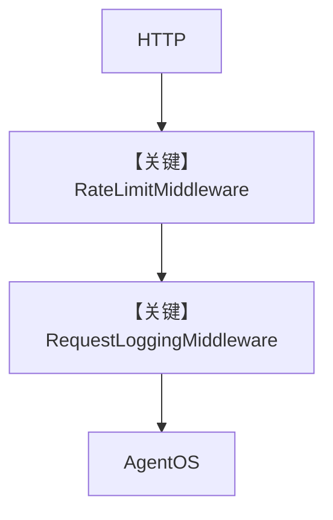

# agent_os_with_custom_middleware.py — 实现原理分析

<!-- cookbook-py-source:start -->
## 完整源码

```python
"""
This example demonstrates how to add custom middleware to your AgentOS application.

We add two middleware:
- Rate Limiting: Limits requests per IP address
- Request/Response Logging: Logs requests and responses
"""

import time
from collections import defaultdict, deque
from typing import Dict

from agno.agent import Agent
from agno.db.postgres import PostgresDb
from agno.models.openai import OpenAIChat
from agno.os import AgentOS
from agno.tools.websearch import WebSearchTools
from fastapi import Request, Response
from fastapi.responses import JSONResponse
from starlette.middleware.base import BaseHTTPMiddleware

# ---------------------------------------------------------------------------
# Create Example
# ---------------------------------------------------------------------------


# === Rate Limiting Middleware ===
class RateLimitMiddleware(BaseHTTPMiddleware):
    """
    Rate limiting middleware that limits requests per IP address.
    """

    def __init__(self, app, requests_per_minute: int = 60, window_size: int = 60):
        super().__init__(app)
        self.requests_per_minute = requests_per_minute
        self.window_size = window_size
        # Store request timestamps per IP
        self.request_history: Dict[str, deque] = defaultdict(lambda: deque())

    async def dispatch(self, request: Request, call_next) -> Response:
        # Get client IP
        client_ip = request.client.host if request.client else "unknown"
        current_time = time.time()

        # Clean old requests outside the window
        history = self.request_history[client_ip]
        while history and current_time - history[0] > self.window_size:
            history.popleft()

        # Check if rate limit exceeded
        if len(history) >= self.requests_per_minute:
            return JSONResponse(
                status_code=429,
                content={
                    "detail": f"Rate limit exceeded. Max {self.requests_per_minute} requests per minute."
                },
            )

        # Add current request to history
        history.append(current_time)

        # Add rate limit headers
        response = await call_next(request)
        response.headers["X-RateLimit-Limit"] = str(self.requests_per_minute)
        response.headers["X-RateLimit-Remaining"] = str(
            self.requests_per_minute - len(history)
        )
        response.headers["X-RateLimit-Reset"] = str(
            int(current_time + self.window_size)
        )

        return response


# === Request/Response Logging Middleware ===
class RequestLoggingMiddleware(BaseHTTPMiddleware):
    """
    Request/response logging middleware with timing and basic info.
    """

    def __init__(self, app, log_body: bool = False, log_headers: bool = False):
        super().__init__(app)
        self.log_body = log_body
        self.log_headers = log_headers
        self.request_count = 0

    async def dispatch(self, request: Request, call_next) -> Response:
        self.request_count += 1
        start_time = time.time()

        # Basic request info
        client_ip = request.client.host if request.client else "unknown"
        print(
            f"[REQ] Request #{self.request_count}: {request.method} {request.url.path} from {client_ip}"
        )

        # Optional: Log headers
        if self.log_headers:
            print(f"[HEADERS] Headers: {dict(request.headers)}")

        # Optional: Log request body
        if self.log_body and request.method in ["POST", "PUT", "PATCH"]:
            body = await request.body()
            if body:
                print(f"[BODY] Body: {body.decode()}")

        # Process request
        response = await call_next(request)

        # Log response info
        duration = time.time() - start_time
        status_label = "[OK]" if response.status_code < 400 else "[ERROR]"
        print(
            f"{status_label} Response: {response.status_code} in {duration * 1000:.1f}ms"
        )

        # Add request count to response header
        response.headers["X-Request-Count"] = str(self.request_count)

        return response


# === Setup database and agent ===
db = PostgresDb(db_url="postgresql+psycopg://ai:ai@localhost:5532/ai")

agent = Agent(
    id="demo-agent",
    name="Demo Agent",
    model=OpenAIChat(id="gpt-4o"),
    db=db,
    tools=[WebSearchTools()],
    markdown=True,
)

agent_os = AgentOS(
    description="Essential middleware demo with rate limiting and logging",
    agents=[agent],
)

app = agent_os.get_app()

# Add custom middleware
app.add_middleware(
    RateLimitMiddleware,
    requests_per_minute=10,
    window_size=60,
)

app.add_middleware(
    RequestLoggingMiddleware,
    log_body=False,
    log_headers=False,
)

# ---------------------------------------------------------------------------
# Run Example
# ---------------------------------------------------------------------------

if __name__ == "__main__":
    """
    Run the essential middleware demo using AgentOS serve method.
    
    Features:
    1. Rate Limiting (10 requests/minute)
    2. Request/Response Logging
    
    Test commands:
    
    1. Basic request:
       curl http://localhost:7777/config
    
    2. Test rate limiting:
       Run in a terminal:
       bash -c 'for i in {1..15}; do curl http://localhost:7777/config; done'
    
    3. Check rate limit headers:
       curl -v http://localhost:7777/config
    
    Look for:
    - Console logs showing request/response info
    - Rate limit headers: X-RateLimit-Limit, X-RateLimit-Remaining, X-RateLimit-Reset
    - Request count header: X-Request-Count
    - 429 errors when rate limit exceeded
    """

    agent_os.serve(
        app="agent_os_with_custom_middleware:app",
        host="localhost",
        port=7777,
        reload=True,
    )
```

<!-- cookbook-py-source:end -->

> 源文件：`cookbook/05_agent_os/middleware/agent_os_with_custom_middleware.py`

## 概述

本示例展示在 **AgentOS 生成的 FastAPI `app` 上 `add_middleware`**：实现 **按 IP 滑动窗口限流**（`RateLimitMiddleware`）与 **请求/响应日志**（`RequestLoggingMiddleware`），在 Agent 逻辑之外做横切控制。

**核心配置一览：**

| 配置项 | 值 | 说明 |
|--------|------|------|
| `agent` | `OpenAIChat(gpt-4o)` + `WebSearchTools` | 业务 Agent |
| `RateLimitMiddleware` | `requests_per_minute=10` | 限流 |
| `RequestLoggingMiddleware` | `log_body/log_headers=False` | 日志 |

## 架构分层

```
HTTP → Starlette Middleware 链 → AgentOS 路由 → Agent.run
```

## 运行机制与因果链

限流在 **进入 Agent 之前** 返回 429；日志统计耗时并写 `X-Request-Count` 等头。

## System Prompt 组装

Agent 未设 `instructions`；依赖默认与工具说明。

## 完整 API 请求

业务仍为 `OpenAIChat.invoke`；中间件不改变消息体，只约束 HTTP 层。

## Mermaid 流程图



## 关键源码文件索引

| 文件 | 关键函数/类 | 作用 |
|------|------------|------|
| `starlette.middleware.base` | `BaseHTTPMiddleware` | 中间件基类 |
