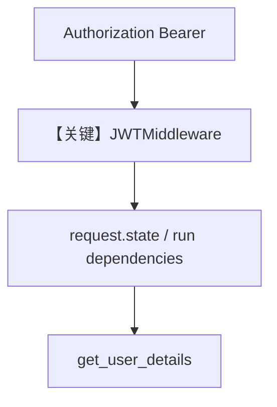

# agent_os_with_jwt_middleware.py — 实现原理分析

> 源文件：`cookbook/05_agent_os/middleware/agent_os_with_jwt_middleware.py`

## 概述

本示例展示 **`JWTMiddleware` + `Authorization` Bearer**：`JWT` 声明映射到 `user_id`（`sub`）、`session_id` 与 `dependencies`（`name`/`email`/`roles`），供工具 **`get_user_details(dependencies: dict)`** 使用；`validate=False` 便于演示注入（生产应开启校验）。

**核心配置一览：**

| 配置项 | 值 | 说明 |
|--------|------|------|
| `JWTMiddleware` | `verification_keys`, `user_id_claim`, `dependencies_claims` | JWT |
| `research_agent` | `id=user-agent`，`tools=[get_user_details]` |  |
| `instructions` | 单行 |  |

## System Prompt 组装

```text
You are a user agent that can get user details if the user asks for them.
```

## 完整 API 请求

HTTP 带 `Authorization: Bearer <jwt>`；内部 run 将 claims 注入 dependencies。

## Mermaid 流程图



## 关键源码文件索引

| 文件 | 关键函数/类 | 作用 |
|------|------------|------|
| `agno/os/middleware` | `JWTMiddleware` | JWT |
