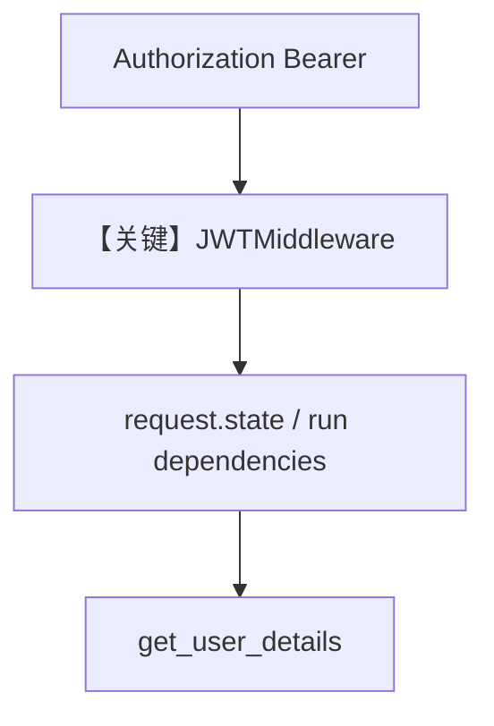

# agent_os_with_jwt_middleware.py — 实现原理分析

<!-- cookbook-py-source:start -->
## 完整源码

```python
"""
This example demonstrates how to use our JWT middleware with AgentOS.

The middleware extracts JWT claims and stores them in request.state for easy access.
This example uses the default Authorization header approach.

For cookie-based authentication, see agent_os_with_jwt_cookies.py
For both header and cookie support, use token_source=TokenSource.BOTH
"""

from datetime import UTC, datetime, timedelta

import jwt
from agno.agent import Agent
from agno.db.postgres import PostgresDb
from agno.models.openai import OpenAIChat
from agno.os import AgentOS
from agno.os.middleware import JWTMiddleware

# ---------------------------------------------------------------------------
# Create Example
# ---------------------------------------------------------------------------

# JWT Secret (use environment variable in production)
JWT_SECRET = "a-string-secret-at-least-256-bits-long"

# Setup database
db = PostgresDb(db_url="postgresql+psycopg://ai:ai@localhost:5532/ai")


# Define a tool that uses dependencies claims
def get_user_details(dependencies: dict):
    """
    Get the current user's details.
    """
    return {
        "name": dependencies.get("name"),
        "email": dependencies.get("email"),
        "roles": dependencies.get("roles"),
    }


# Create agent
research_agent = Agent(
    id="user-agent",
    model=OpenAIChat(id="gpt-4o"),
    db=db,
    tools=[get_user_details],
    instructions="You are a user agent that can get user details if the user asks for them.",
)


agent_os = AgentOS(
    description="JWT Protected AgentOS",
    agents=[research_agent],
)

# Get the final app
app = agent_os.get_app()

# Add JWT middleware to the app
# This middleware will automatically extract JWT values into request.state
app.add_middleware(
    JWTMiddleware,
    verification_keys=[JWT_SECRET],
    algorithm="HS256",
    user_id_claim="sub",  # Extract user_id from 'sub' claim
    session_id_claim="session_id",  # Extract session_id from 'session_id' claim
    dependencies_claims=["name", "email", "roles"],
    # In this example, we want this middleware to demonstrate parameter injection, not token validation.
    # In production scenarios, you will probably also want token validation. Be careful setting this to False.
    validate=False,
)

# ---------------------------------------------------------------------------
# Run Example
# ---------------------------------------------------------------------------

if __name__ == "__main__":
    """
    Run your AgentOS with JWT parameter injection.

    Test by calling /agents/user-agent/runs with a message: "What do you know about me?"
    """
    # Test token with user_id and session_id:
    payload = {
        "sub": "user_123",  # This will be injected as user_id parameter
        "session_id": "demo_session_456",  # This will be injected as session_id parameter
        "exp": datetime.now(UTC) + timedelta(hours=24),
        "iat": datetime.now(UTC),
        # Dependency claims
        "name": "John Doe",
        "email": "john.doe@example.com",
        "roles": ["admin", "user"],
    }
    token = jwt.encode(payload, JWT_SECRET, algorithm="HS256")
    print("Test token:")
    print(token)
    agent_os.serve(app="agent_os_with_jwt_middleware:app", port=7777, reload=True)
```

<!-- cookbook-py-source:end -->

> 源文件：`cookbook/05_agent_os/middleware/agent_os_with_jwt_middleware.py`

## 概述

本示例展示 **`JWTMiddleware` + `Authorization` Bearer**：`JWT` 声明映射到 `user_id`（`sub`）、`session_id` 与 `dependencies`（`name`/`email`/`roles`），供工具 **`get_user_details(dependencies: dict)`** 使用；`validate=False` 便于演示注入（生产应开启校验）。

**核心配置一览：**

| 配置项 | 值 | 说明 |
|--------|------|------|
| `JWTMiddleware` | `verification_keys`, `user_id_claim`, `dependencies_claims` | JWT |
| `research_agent` | `id=user-agent`，`tools=[get_user_details]` |  |
| `instructions` | 单行 |  |

## System Prompt 组装

```text
You are a user agent that can get user details if the user asks for them.
```

## 完整 API 请求

HTTP 带 `Authorization: Bearer <jwt>`；内部 run 将 claims 注入 dependencies。

## Mermaid 流程图



## 关键源码文件索引

| 文件 | 关键函数/类 | 作用 |
|------|------------|------|
| `agno/os/middleware` | `JWTMiddleware` | JWT |
