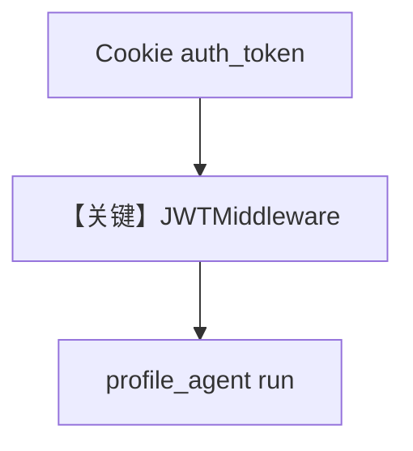

# agent_os_with_jwt_middleware_cookies.py — 实现原理分析

> 源文件：`cookbook/05_agent_os/middleware/agent_os_with_jwt_middleware_cookies.py`

## 概述

本示例展示 **`JWTMiddleware` + `TokenSource` 从 Cookie 读 JWT**（`auth_token`），并提供一个 **`/set-auth-cookie` 演示端点** 写入 HttpOnly Cookie；与 header 版对照，适合浏览器类客户端。

**核心配置一览：**

| 配置项 | 值 | 说明 |
|--------|------|------|
| `JWTMiddleware` | `token_source` 含 Cookie 路径 | 见源码后半 |
| `profile_agent` | `tools=[get_user_profile]` | 档案工具 |
| 自定义 `FastAPI` | `set_auth_cookie` | 发 cookie |

## System Prompt 组装

```text
You are a profile agent. You can search for information and access user profiles.
```

## 完整 API 请求

先 `GET /set-auth-cookie` 或登录流拿 cookie，再访问受保护 Agent 路由。

## Mermaid 流程图



## 关键源码文件索引

| 文件 | 关键函数/类 | 作用 |
|------|------------|------|
| `agno/os/middleware` | `JWTMiddleware`, `TokenSource` | Cookie/Header |
