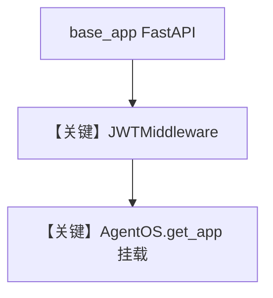

# custom_fastapi_app_with_jwt_middleware.py — 实现原理分析

<!-- cookbook-py-source:start -->
## 完整源码

```python
"""
This example demonstrates how to use our JWT middleware with your custom FastAPI app.

# Note: This example won't work with the AgentOS UI, because of the token validation mechanism in the JWT middleware.
"""

from datetime import UTC, datetime, timedelta

import jwt
from agno.agent import Agent
from agno.db.postgres import PostgresDb
from agno.models.openai import OpenAIChat
from agno.os import AgentOS
from agno.os.middleware import JWTMiddleware
from agno.tools.websearch import WebSearchTools
from fastapi import FastAPI, Form, HTTPException

# ---------------------------------------------------------------------------
# Create Example
# ---------------------------------------------------------------------------

# JWT Secret (use environment variable in production)
JWT_SECRET = "a-string-secret-at-least-256-bits-long"

# Setup database
db = PostgresDb(db_url="postgresql+psycopg://ai:ai@localhost:5532/ai")

# Create agent
research_agent = Agent(
    id="research-agent",
    name="Research Agent",
    model=OpenAIChat(id="gpt-4o"),
    db=db,
    tools=[WebSearchTools()],
    add_history_to_context=True,
    markdown=True,
)

# Create custom FastAPI app
app = FastAPI(
    title="Example Custom App",
    version="1.0.0",
)

# Add JWT middleware
app.add_middleware(
    JWTMiddleware,
    verification_keys=[JWT_SECRET],
    algorithm="HS256",  # Use HS256 for symmetric key
    excluded_route_paths=[
        "/auth/login"
    ],  # We don't want to validate the token for the login endpoint
)


# Custom routes that shouldn't be protected by JWT
@app.post("/auth/login")
async def login(username: str = Form(...), password: str = Form(...)):
    """Login endpoint that returns JWT token"""
    if username == "demo" and password == "password":
        payload = {
            "sub": "user_123",
            "username": username,
            "exp": datetime.now(UTC) + timedelta(hours=24),
            "iat": datetime.now(UTC),
        }
        token = jwt.encode(payload, JWT_SECRET, algorithm="HS256")
        return {"access_token": token, "token_type": "bearer"}

    raise HTTPException(status_code=401, detail="Invalid credentials")


# Clean AgentOS setup with tuple middleware pattern! ✨
agent_os = AgentOS(
    description="JWT Protected AgentOS",
    agents=[research_agent],
    base_app=app,
)

# Get the final app
app = agent_os.get_app()

# ---------------------------------------------------------------------------
# Run Example
# ---------------------------------------------------------------------------

if __name__ == "__main__":
    """
    Run your AgentOS with JWT middleware applied to the entire app.

    Test endpoints:
    1. POST /auth/login - Login to get JWT token
    2. GET /config - Protected route (requires JWT)
    """
    agent_os.serve(
        app="custom_fastapi_app_with_jwt_middleware:app", port=7777, reload=True
    )
```

<!-- cookbook-py-source:end -->

> 源文件：`cookbook/05_agent_os/middleware/custom_fastapi_app_with_jwt_middleware.py`

## 概述

本示例展示 **`AgentOS(base_app=自定义 FastAPI)`**：先自建 `FastAPI`，挂上 `JWTMiddleware` 与 **`/auth/login`**（表单发 JWT），再把 **`AgentOS(agents=[...], base_app=app)`**  mount 进去，实现登录与 Agent API 同进程；注释说明与 AgentOS UI 的 token 校验可能不兼容。

**核心配置一览：**

| 配置项 | 值 | 说明 |
|--------|------|------|
| `base_app` | 自定义 `FastAPI` | 登录路由 |
| `excluded_route_paths` | `["/auth/login"]` | 登录免 JWT |
| `research_agent` | `WebSearchTools` | 业务 |

## 架构分层

```
自定义路由 (/auth/login) → JWT → AgentOS 挂载路由 (/agents/...)
```

## System Prompt 组装

Agent 无显式 `instructions`（仅默认）。

## Mermaid 流程图



## 关键源码文件索引

| 文件 | 关键函数/类 | 作用 |
|------|------------|------|
| `agno/os` | `AgentOS(base_app=...)` | 合并应用 |
