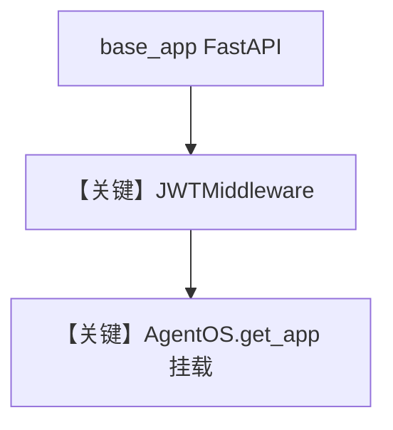

# custom_fastapi_app_with_jwt_middleware.py — 实现原理分析

> 源文件：`cookbook/05_agent_os/middleware/custom_fastapi_app_with_jwt_middleware.py`

## 概述

本示例展示 **`AgentOS(base_app=自定义 FastAPI)`**：先自建 `FastAPI`，挂上 `JWTMiddleware` 与 **`/auth/login`**（表单发 JWT），再把 **`AgentOS(agents=[...], base_app=app)`**  mount 进去，实现登录与 Agent API 同进程；注释说明与 AgentOS UI 的 token 校验可能不兼容。

**核心配置一览：**

| 配置项 | 值 | 说明 |
|--------|------|------|
| `base_app` | 自定义 `FastAPI` | 登录路由 |
| `excluded_route_paths` | `["/auth/login"]` | 登录免 JWT |
| `research_agent` | `WebSearchTools` | 业务 |

## 架构分层

```
自定义路由 (/auth/login) → JWT → AgentOS 挂载路由 (/agents/...)
```

## System Prompt 组装

Agent 无显式 `instructions`（仅默认）。

## Mermaid 流程图



## 关键源码文件索引

| 文件 | 关键函数/类 | 作用 |
|------|------------|------|
| `agno/os` | `AgentOS(base_app=...)` | 合并应用 |
