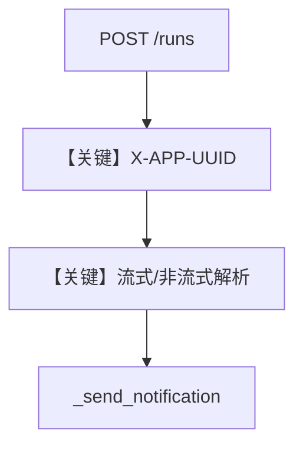

# extract_content_middleware.py — 实现原理分析

> 源文件：`cookbook/05_agent_os/middleware/extract_content_middleware.py`

## 概述

本示例展示 **`ContentExtractionMiddleware`**：对 **`POST .../runs`** 拦截响应，若带 **`X-APP-UUID`** 头则解析 **流式 SSE** 或 **非流式 JSON**，汇总 `RunContent` 的 `content` 后调用 `_send_notification`（示例为 `print`），用于对接外部通知服务。

**核心配置一览：**

| 配置项 | 值 | 说明 |
|--------|------|------|
| `user_request_bot` | `Agent`，**未显式设置 `model`** | 运行前须可解析默认模型，否则需自行补全 |
| `update_memory_on_run` | `True` | 记忆 |

## 备注

若 Agent 未配置 `model`，实际运行可能依赖框架默认；生产环境应显式指定 `model`。

## System Prompt 组装

```text
You are a user agent. You are asked to answer queries about the user.
```

## Mermaid 流程图



## 关键源码文件索引

| 文件 | 关键函数/类 | 作用 |
|------|------------|------|
| `starlette` | `StreamingResponse` | SSE |
