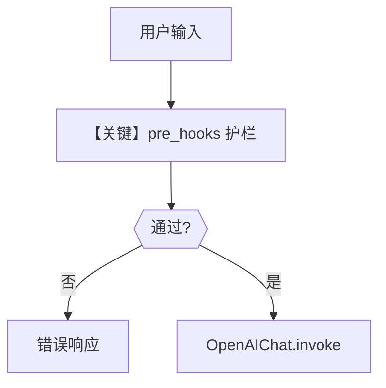

# guardrails_demo.py — 实现原理分析

> 源文件：`cookbook/05_agent_os/middleware/guardrails_demo.py`

## 概述

本示例展示 **`pre_hooks` 护栏** 在 **Agent 与 Team** 上同时配置：`OpenAIModerationGuardrail`、`PromptInjectionGuardrail`、`PIIDetectionGuardrail` 在 **run 前** 拦截用户输入，失败时 UI 显示错误（见文件头说明）。

**核心配置一览：**

| 配置项 | 值 | 说明 |
|--------|------|------|
| `chat_agent` | `pre_hooks` 三元组 | Agent 级 |
| `guardrails_team` | 同护栏 + `members=[chat_agent]` | Team 级，`retries=3` |
| `instructions` | 友好助手 |  |

## 运行机制与因果链

护栏在 **进入 `get_run_messages` / 模型** 之前执行；与中间件不同，属于 Agent run 管线内 hook。

## System Prompt 组装

```text
You are a helpful assistant that can answer questions and help with tasks.
Always answer in a friendly and helpful tone.
Never be rude or offensive.
```

## Mermaid 流程图



## 关键源码文件索引

| 文件 | 关键函数/类 | 作用 |
|------|------------|------|
| `agno/guardrails` | `PromptInjectionGuardrail` 等 | 前置拦截 |
