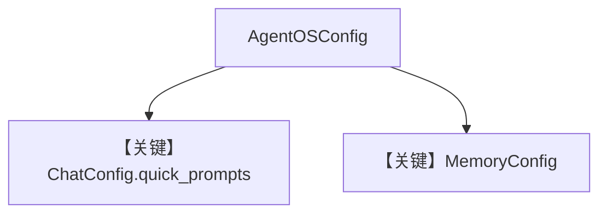

# basic.py — 实现原理分析

> 源文件：`cookbook/05_agent_os/os_config/basic.py`

## 概述

本示例展示 **`AgentOSConfig` 程序化配置**：`ChatConfig.quick_prompts` 为 UI 提供按 agent id 快捷提示；`MemoryConfig` + `DatabaseConfig` 将 **Postgres `db`** 与记忆域展示名绑定；同一 OS 挂载 **Agent / Team / Workflow**，且 Workflow 使用 **第二数据库 `db2`**。

**核心配置一览：**

| 配置项 | 值 | 说明 |
|--------|------|------|
| `basic_agent` | 无显式 `model` | 运行期默认模型或须补全 |
| `basic_team` | `OpenAIChat(gpt-4o)` | 队长模型 |
| `basic_workflow` | `db=db2` | 工作流会话库分离 |
| `config` | `AgentOSConfig(chat=..., memory=...)` | OS 级 |

## System Prompt 组装

`basic_agent` 无 `instructions`；Team/Workflow 行为见各自实现。

## Mermaid 流程图

## 关键源码文件索引

| 文件 | 关键函数/类 | 作用 |
|------|------------|------|
| `agno/os/config` | `AgentOSConfig` | 配置模型 |
