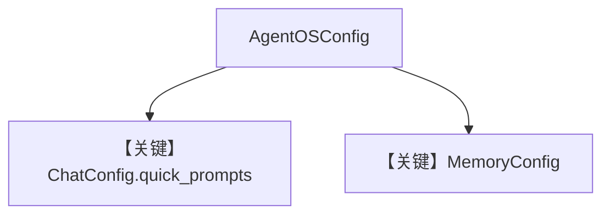

# basic.py — 实现原理分析

<!-- cookbook-py-source:start -->
## 完整源码

```python
"""
Basic
=====

Demonstrates basic.
"""

from agno.agent import Agent
from agno.db.postgres import PostgresDb
from agno.models.openai import OpenAIChat
from agno.os import AgentOS
from agno.os.config import (
    AgentOSConfig,
    ChatConfig,
    DatabaseConfig,
    MemoryConfig,
    MemoryDomainConfig,
)
from agno.team import Team
from agno.workflow.step import Step
from agno.workflow.workflow import Workflow

# Setup the database
db = PostgresDb(db_url="postgresql+psycopg://ai:ai@localhost:5532/ai", id="db-0001")
db2 = PostgresDb(db_url="postgresql+psycopg://ai:ai@localhost:5532/ai2", id="db-0002")

# ---------------------------------------------------------------------------
# Create Agent, Team, And Workflow
# ---------------------------------------------------------------------------
basic_agent = Agent(
    name="Marketing Agent",
    db=db,
    enable_session_summaries=True,
    update_memory_on_run=True,
    add_history_to_context=True,
    num_history_runs=3,
    add_datetime_to_context=True,
    markdown=True,
)
basic_team = Team(
    id="basic-team",
    name="Basic Team",
    model=OpenAIChat(id="gpt-4o"),
    db=db,
    members=[basic_agent],
    update_memory_on_run=True,
)
basic_workflow = Workflow(
    id="basic-workflow",
    name="Basic Workflow",
    description="Just a simple workflow",
    db=db2,
    steps=[
        Step(
            name="step1",
            description="Just a simple step",
            agent=basic_agent,
        )
    ],
)

# Setup our AgentOS app
agent_os = AgentOS(
    description="Your AgentOS",
    id="basic-os",
    agents=[basic_agent],
    teams=[basic_team],
    workflows=[basic_workflow],
    # Configuration for the AgentOS
    config=AgentOSConfig(
        chat=ChatConfig(
            quick_prompts={
                "marketing-agent": [
                    "What can you do?",
                    "How is our latest post working?",
                    "Tell me about our active marketing campaigns",
                ],
            },
        ),
        memory=MemoryConfig(
            dbs=[
                DatabaseConfig(
                    db_id=db.id,
                    domain_config=MemoryDomainConfig(
                        display_name="Main app user memories",
                    ),
                )
            ],
        ),
    ),
)
app = agent_os.get_app()


# ---------------------------------------------------------------------------
# Run Example
# ---------------------------------------------------------------------------

if __name__ == "__main__":
    """Run your AgentOS.

    You can see the configuration and available endpoints at:
    http://localhost:7777/config
    """
    agent_os.serve(app="basic:app", reload=True)
```

<!-- cookbook-py-source:end -->

> 源文件：`cookbook/05_agent_os/os_config/basic.py`

## 概述

本示例展示 **`AgentOSConfig` 程序化配置**：`ChatConfig.quick_prompts` 为 UI 提供按 agent id 快捷提示；`MemoryConfig` + `DatabaseConfig` 将 **Postgres `db`** 与记忆域展示名绑定；同一 OS 挂载 **Agent / Team / Workflow**，且 Workflow 使用 **第二数据库 `db2`**。

**核心配置一览：**

| 配置项 | 值 | 说明 |
|--------|------|------|
| `basic_agent` | 无显式 `model` | 运行期默认模型或须补全 |
| `basic_team` | `OpenAIChat(gpt-4o)` | 队长模型 |
| `basic_workflow` | `db=db2` | 工作流会话库分离 |
| `config` | `AgentOSConfig(chat=..., memory=...)` | OS 级 |

## System Prompt 组装

`basic_agent` 无 `instructions`；Team/Workflow 行为见各自实现。

## Mermaid 流程图



## 关键源码文件索引

| 文件 | 关键函数/类 | 作用 |
|------|------------|------|
| `agno/os/config` | `AgentOSConfig` | 配置模型 |
