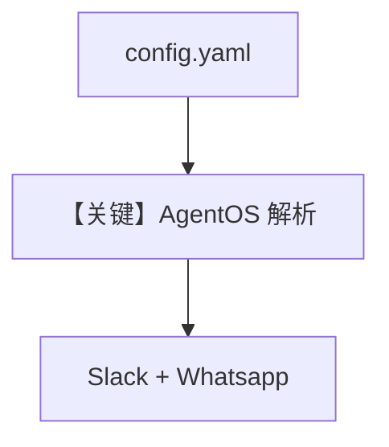

# yaml_config.py — 实现原理分析

> 源文件：`cookbook/05_agent_os/os_config/yaml_config.py`

## 概述

本示例展示 **`AgentOS(config=os_config_path)` 从 YAML 加载 OS 配置**（`config.yaml` 与脚本同目录），与 `basic.py` 同样注册 Agent/Team/Workflow，并增加 **Whatsapp + Slack** 双接口。

**核心配置一览：**

| 配置项 | 值 | 说明 |
|--------|------|------|
| `config` | `str(path to config.yaml)` | 外部 YAML |
| `interfaces` | `Whatsapp`, `Slack` | 双通道 |

## 与 basic.py 差异

配置从 **代码内 `AgentOSConfig`** 换为 **文件**；便于运维与多环境。

## Mermaid 流程图

## 关键源码文件索引

| 文件 | 关键函数/类 | 作用 |
|------|------------|------|
| `agno/os` | `AgentOS(config=path)` | YAML |
