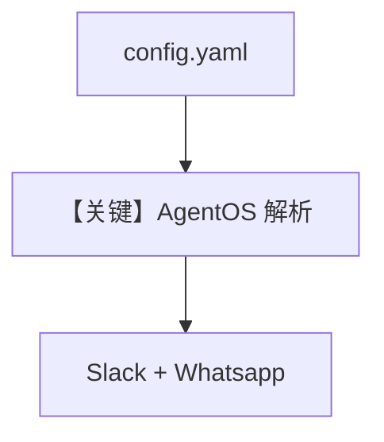

# yaml_config.py — 实现原理分析

<!-- cookbook-py-source:start -->
## 完整源码

```python
"""
Yaml Config
===========

Demonstrates yaml config.
"""

from pathlib import Path

from agno.agent import Agent
from agno.db.postgres import PostgresDb
from agno.models.openai import OpenAIChat
from agno.os import AgentOS
from agno.os.interfaces.slack import Slack
from agno.os.interfaces.whatsapp import Whatsapp
from agno.team import Team
from agno.workflow.step import Step
from agno.workflow.workflow import Workflow

# ---------------------------------------------------------------------------
# Create Example
# ---------------------------------------------------------------------------

cwd = Path(__file__).parent
os_config_path = str(cwd.joinpath("config.yaml"))

# Setup the database
db = PostgresDb(db_url="postgresql+psycopg://ai:ai@localhost:5532/ai", id="db-0001")

# Setup basic agents, teams and workflows
basic_agent = Agent(
    id="basic-agent",
    name="Basic Agent",
    db=db,
    enable_session_summaries=True,
    update_memory_on_run=True,
    add_history_to_context=True,
    num_history_runs=3,
    add_datetime_to_context=True,
    markdown=True,
)
basic_team = Team(
    id="basic-team",
    name="Basic Team",
    model=OpenAIChat(id="gpt-4o"),
    db=db,
    members=[basic_agent],
    update_memory_on_run=True,
)
basic_workflow = Workflow(
    id="basic-workflow",
    name="Basic Workflow",
    description="Just a simple workflow",
    db=db,
    steps=[
        Step(
            name="step1",
            description="Just a simple step",
            agent=basic_agent,
        )
    ],
)

# Setup our AgentOS app
agent_os = AgentOS(
    description="Example AgentOS",
    id="basic-os",
    agents=[basic_agent],
    teams=[basic_team],
    workflows=[basic_workflow],
    interfaces=[Whatsapp(agent=basic_agent), Slack(agent=basic_agent)],
    # Configuration for the AgentOS
    config=os_config_path,
)
app = agent_os.get_app()


# ---------------------------------------------------------------------------
# Run Example
# ---------------------------------------------------------------------------

if __name__ == "__main__":
    """Run your AgentOS.

    You can see the configuration and available endpoints at:
    http://localhost:7777/config
    """
    agent_os.serve(app="yaml_config:app", reload=True)
```

<!-- cookbook-py-source:end -->

> 源文件：`cookbook/05_agent_os/os_config/yaml_config.py`

## 概述

本示例展示 **`AgentOS(config=os_config_path)` 从 YAML 加载 OS 配置**（`config.yaml` 与脚本同目录），与 `basic.py` 同样注册 Agent/Team/Workflow，并增加 **Whatsapp + Slack** 双接口。

**核心配置一览：**

| 配置项 | 值 | 说明 |
|--------|------|------|
| `config` | `str(path to config.yaml)` | 外部 YAML |
| `interfaces` | `Whatsapp`, `Slack` | 双通道 |

## 与 basic.py 差异

配置从 **代码内 `AgentOSConfig`** 换为 **文件**；便于运维与多环境。

## Mermaid 流程图



## 关键源码文件索引

| 文件 | 关键函数/类 | 作用 |
|------|------------|------|
| `agno/os` | `AgentOS(config=path)` | YAML |
