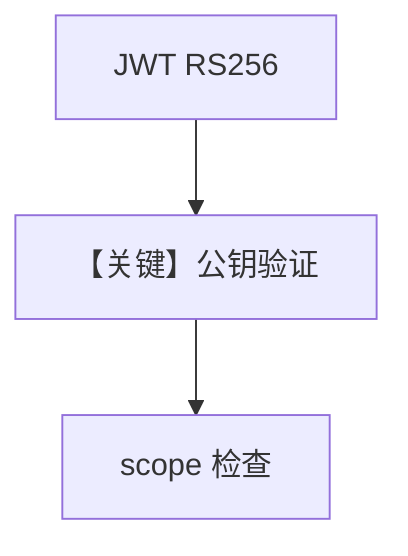

# basic.py — 实现原理分析

<!-- cookbook-py-source:start -->
## 完整源码

```python
"""
Basic RBAC Example with AgentOS (Asymmetric Keys)

This example demonstrates how to enable RBAC (Role-Based Access Control)
with JWT token authentication using RS256 asymmetric keys.

RS256 uses:
- Private key: Used by your auth server to SIGN tokens
- Public key: Used by AgentOS to VERIFY token signatures

Prerequisites:
- Set JWT_SIGNING_KEY and JWT_VERIFICATION_KEY environment variables with your public and private keys (PEM format)
- Or generate keys at runtime for testing (as shown below)
- Endpoints are automatically protected with default scope mappings
"""

import os
from datetime import UTC, datetime, timedelta

import jwt
from agno.agent import Agent
from agno.db.postgres import PostgresDb
from agno.models.openai import OpenAIChat
from agno.os import AgentOS
from agno.os.config import AuthorizationConfig
from agno.tools.websearch import WebSearchTools
from agno.utils.cryptography import generate_rsa_keys

# ---------------------------------------------------------------------------
# Create Example
# ---------------------------------------------------------------------------

# Keys file path for persistence across reloads
_KEYS_FILE = "/tmp/agno_rbac_demo_keys.json"


def _load_or_generate_keys():
    """Load keys from file or generate new ones. Persists keys for reload consistency."""
    import json

    # First check environment variables
    public_key = os.getenv("JWT_VERIFICATION_KEY", None)
    private_key = os.getenv("JWT_SIGNING_KEY", None)

    if public_key and private_key:
        return private_key, public_key

    # Try to load from file (for reload consistency)
    if os.path.exists(_KEYS_FILE):
        with open(_KEYS_FILE, "r") as f:
            keys = json.load(f)
            return keys["private_key"], keys["public_key"]

    # Generate new keys and save them
    private_key, public_key = generate_rsa_keys()
    with open(_KEYS_FILE, "w") as f:
        json.dump({"private_key": private_key, "public_key": public_key}, f)

    return private_key, public_key


PRIVATE_KEY, PUBLIC_KEY = _load_or_generate_keys()

# Setup database
db = PostgresDb(db_url="postgresql+psycopg://ai:ai@localhost:5532/ai")

# Create agents
research_agent = Agent(
    id="research-agent",
    name="Research Agent",
    model=OpenAIChat(id="gpt-4o"),
    db=db,
    tools=[WebSearchTools()],
    add_history_to_context=True,
    markdown=True,
)

# Create AgentOS with RS256 (default algorithm)
agent_os = AgentOS(
    id="my-agent-os",
    description="RBAC Protected AgentOS",
    agents=[research_agent],
    authorization=True,
    authorization_config=AuthorizationConfig(
        verification_keys=[PUBLIC_KEY],
        algorithm="RS256",
    ),
)

# Get the app
app = agent_os.get_app()


# ---------------------------------------------------------------------------
# Run Example
# ---------------------------------------------------------------------------

if __name__ == "__main__":
    """
    Run your AgentOS with RBAC enabled using RS256 asymmetric keys.
    
    Key Distribution:
    - Private key: Keep secret on your auth server (signs tokens)
    - Public key: Share with AgentOS (verifies tokens)
    
    Audience Verification:
    - Tokens must include `aud` claim matching the AgentOS ID
    - Tokens with wrong audience will be rejected
    
    Default scope mappings protect all endpoints:
    - GET /agents/{agent_id}: requires "agents:read"
    - POST /agents/{agent_id}/runs: requires "agents:run"
    - GET /sessions: requires "sessions:read"
    - GET /memory: requires "memory:read"
    - etc.
    
    Scope format:
    - "agents:read" - List all agents
    - "agents:research-agent:run" - Run specific agent
    - "agents:*:run" - Run any agent
    - "agent_os:admin" - Full access to everything
    """
    if PRIVATE_KEY:
        # Create test tokens signed with the PRIVATE key
        # Note: Include `aud` claim with AgentOS ID
        user_token_payload = {
            "sub": "user_123",
            "session_id": "session_456",
            "scopes": ["agents:read", "agents:run"],
            "exp": datetime.now(UTC) + timedelta(hours=24),
            "iat": datetime.now(UTC),
        }
        user_token = jwt.encode(user_token_payload, PRIVATE_KEY, algorithm="RS256")

        admin_token_payload = {
            "sub": "admin_789",
            "session_id": "admin_session_123",
            "scopes": ["agent_os:admin"],  # Admin has access to everything
            "exp": datetime.now(UTC) + timedelta(hours=24),
            "iat": datetime.now(UTC),
        }
        admin_token = jwt.encode(admin_token_payload, PRIVATE_KEY, algorithm="RS256")

        print("\n" + "=" * 60)
        print("RBAC Test Tokens (RS256 Asymmetric)")
        print("=" * 60)
        print(
            "Keys loaded from: "
            + (_KEYS_FILE if os.path.exists(_KEYS_FILE) else "environment variables")
        )
        print("To generate fresh keys, delete: " + _KEYS_FILE)

        print("Public Key: \n" + PUBLIC_KEY)

        print("\nAdmin Token (agent_os:admin - full access):")
        print(admin_token)
        print("\n" + "=" * 60 + "\n")

    agent_os.serve(app="basic:app", port=7777, reload=True)
```

<!-- cookbook-py-source:end -->

> 源文件：`cookbook/05_agent_os/rbac/asymmetric/basic.py`

## 概述

本示例展示 **RBAC + RS256 非对称密钥**：`generate_rsa_keys` 或环境变量 `JWT_SIGNING_KEY` / `JWT_VERIFICATION_KEY`；`AuthorizationConfig` 用 **公钥验签**，JWT 由私钥方签发；端点受默认 scope 保护。

**核心配置一览：**

| 配置项 | 值 | 说明 |
|--------|------|------|
| `authorization` | `True` + `AuthorizationConfig(algorithm="RS256", ...)` | 非对称 |
| `research_agent` | `gpt-4o` + `WebSearchTools` | 业务 |

## 运行机制与因果链

私钥仅签名端使用；AgentOS 持公钥验证；`aud` 与 scope 见 `__main__` 注释。

## Mermaid 流程图



## 关键源码文件索引

| 文件 | 关键函数/类 | 作用 |
|------|------------|------|
| `agno/os/config` | `AuthorizationConfig` | RBAC |
| `agno/utils/cryptography` | `generate_rsa_keys` | 密钥 |
