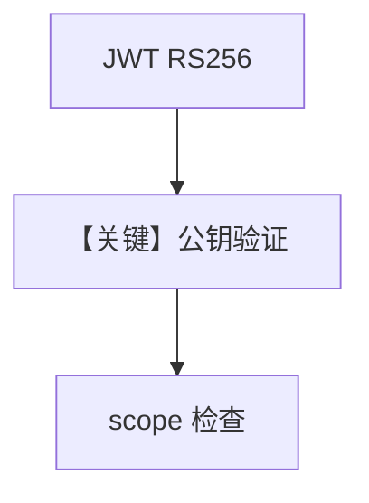

# basic.py — 实现原理分析

> 源文件：`cookbook/05_agent_os/rbac/asymmetric/basic.py`

## 概述

本示例展示 **RBAC + RS256 非对称密钥**：`generate_rsa_keys` 或环境变量 `JWT_SIGNING_KEY` / `JWT_VERIFICATION_KEY`；`AuthorizationConfig` 用 **公钥验签**，JWT 由私钥方签发；端点受默认 scope 保护。

**核心配置一览：**

| 配置项 | 值 | 说明 |
|--------|------|------|
| `authorization` | `True` + `AuthorizationConfig(algorithm="RS256", ...)` | 非对称 |
| `research_agent` | `gpt-4o` + `WebSearchTools` | 业务 |

## 运行机制与因果链

私钥仅签名端使用；AgentOS 持公钥验证；`aud` 与 scope 见 `__main__` 注释。

## Mermaid 流程图

## 关键源码文件索引

| 文件 | 关键函数/类 | 作用 |
|------|------------|------|
| `agno/os/config` | `AuthorizationConfig` | RBAC |
| `agno/utils/cryptography` | `generate_rsa_keys` | 密钥 |
